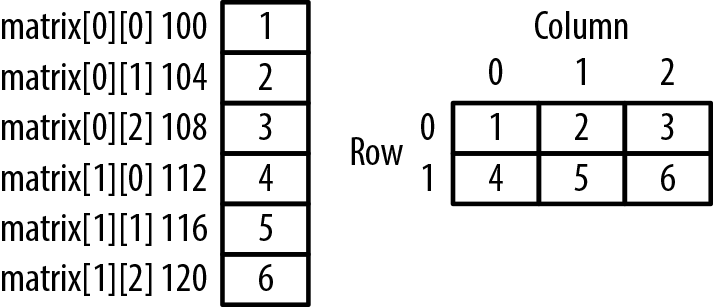
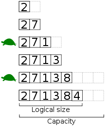

# 배열 (Array)

#### 배열은 값 또는 변수 엘리먼트의 집합으로 구성된 구조로, 하나 이상의 인덱스 또는 키로 식별

- **자료구조** - 메모리 공간 기반의 **연속(Contiguous방식)** / 포인터 기반의 **연결(Link) 방식**으로 나뉨
- **배열은 연속 방식** / 연결리스트는 연결 방식
- 추상자료형은 주로 배열 또는 열결 리스트를 기반 / 스택(연결리스트) / 큐(배열)
- **C에서는** 배열은 크기를 지정하고 해당 크기만큼의 연속된 메모리 공간을 할당받는 작업을 수행하는
  자료형 / 배열의 크기 변경이 어려움



- 배열의 메모리 주소는 4바이트씩 증가함. 각 엘리먼트도 4바이트
- 배열은 어디서나 O(1)에 조회가능함 (즉시 주소를 계산할 수 있기 때문에)

#### 메모리와 포인터

- 32비트 머신의 포인터는 32비트 / 64비트 머신의 포인터는 64비트
- 포인터는 메모리 영역을 1바이트 단위로 가리키는 주소
- 32비트 머신은 메모리 주소를 0에서 2^32-1까지 표현--> 최대 4GB까지 지정 --> 메모리르 4GB 이상 인식못함
- 64비트 머신은 2^64, 약 16EB(엑사바이트)라는 엄청난 크기의 가상 메모리를 가리킬 수 있어 -> 당분간 메모리
  인식 문제는 없을 것이다.

#### 동적 배열

- 고정된 배열 크기는 쓰기가 불편 --> 크기를 지정하지 않고 자동으로 리사이징하는 배열인 동적 배열 등장
- 자바의 ArrayList, C++ std::vector, 파이썬 List / 대부분의 동적 프로그래밍 언어는 정적배열 자체가 없음
- 미리 초깃값을 작게 잡아 배열을 생성하고, 데이터가 추가되면서 꽉 채워지면, 늘려주고 모두 복사하는 방식
  **더블링(Doubling)** - 2배씩 늘려줌

```C
// cpython/Objects/listobject.c
// the growth pattern is: 0,4,8,16,25,35,46,58,72,88...
new_allocated = (size_t)newsize + (newsize >> 3) + (newsize < 9 ? 3 : 6);
// 그로스 팩터는 초반에는 2배지만 전체적으로는 약 1.125배 / 다른 언어에 비해 적은편
// 자바는 1.5 배  , C 는 2배
```



- 위 사진에서 거북이는 재할당 될때 삽입시간이 느리다는 표현 O(n) / 보통은 삽입 빠름 O(1)

## 실습 파일 참조...