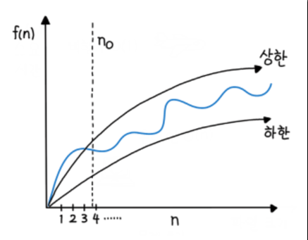

# 빅오, 자료형

- 입력값이 커질 때 알고리즘의 실행 시간(시간 복잡도)와 함께 공간 요구사항(공간 복잡도)이 어떻게 증가하는지 분류하는 데 사용, 효율성 분석

#### 빅오(O, big-O)란 입력값이 무한대로 향할때 함수의 상한을 설명하는 수학적 표기방법

- 점근적 실행 시간(Asymptotic Running Time)은 달리 말하면 시간 복잡도(Time complexity Computational Complexity)를 의미
- 입력값 n에 대해서 **4n^2 + 3n + 4**만큼 계산하는 함수가 있으면 먼저 최고차항 4^n만 고려하고, 이중에서도 **n^2만 고려한다**.
- O(1) : 실행시간이 항상 일정 / 최고의 알고리즘일 수 있다. / 하지만 상수가 매우크면 의미 없음
- O(log n): 왠만한 n 크기에 대해서도 매우 견고함 ex) 이진검색
- O(n) : 입력값과 비례 / Linear-time 알고리즘 / 리스트에서 최댓값, 최솟값을 찾는 경우 / 모든 입력값 한 번은 봄
- O (nlogn) : 대부분의 효율 좋은 알고리즘이 이에 해당 / 적어도 모든 수에 대해 한 번 이상은 비교해야 하는 비교 기간 정렬 알고리즘은 아무리 좋아도 O(nlogn)보다 빠를 수 없음 / 병합정렬
- O (n^2) : 버블정렬 / 비효율적 정렬 알고리즘
- O (2^n) : 피보나치 수 재귀활용

- O (n!) : 각 도시를 방문하고 돌아오는 가장 짧은 경로(Traveling salesman problem,TSP)를 브루트 포스로 풀이할 때 / 가장 느림

##### 알고리즘은 흔힌 '시간과 공간이 트레이드오프' / 실행 시간이 빠른 알고리즘은 공간을 많이 사용, 공간을 적게 차지하는 알고리즘은 실행시간 느림

### 상한과 최악

- 빅오(O) : 상한 / 빅오메가 : 하한 / 빅세타: 평균
- 빅오는 최악의 경우의 시간 복잡도와는 아무런 관계가 없음
- 
- 빅오 표기는 복잡한 함수 f(n)이 있을 경우, 함수의 실행 상한과 하한을 의미함 / 가장 늦게 실행될 때를 빅오(O)
  가장 빨리 실행될 떄 빅오메가(Ω), 평균 빅 세타(Θ)로 지칭. 
- 빅오 표기법은 n이 매울 클 때의 전체적인 큰 그림에 집중

### 분할 상환 분석

- 시간 또는 메모리를 분석하는 알고리즘의 복잡도 계산 시, 알고리즘 전체를 보지 않고 최악의 경우만 보는 것은 지나치게 비관적이라는 이유로 분할 상환 분석 방법 등장
- Amortized Analysis
- 동적 배열에서 더블링이 일어나는 일은 어쩌다 한번이지만, 이로 인해 '아이템 삽입 시간 복잡도는 O(n)이다' 라고 얘기하는 것은 지나치게 비관적
- 분할 상환 -> 최악의 경우를 여러 번에 걸쳐 골고루 나눠주는 형태로 알고리즘의 시간 복잡도 계산 가능
  이 경우 동적배열은 O(1)이 됨
- 1985 로버트 타잔 소개 / 최근에 시간 복잡도 분석 시 잘 쓰임

### 병렬화

- 일부알고리즘은 병렬화로 실행 속도 높일 수 있음
- 딥러닝의 인기와 함께 주목 / GPU가 대표적 / CPU보다 수백 배 더 많은 연산을 동시에 수행
- 그래서 병렬화도 알고리즘의 우수성을 평가하는 매우 중요한 척도