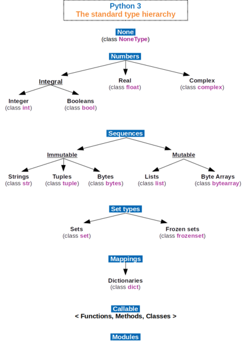
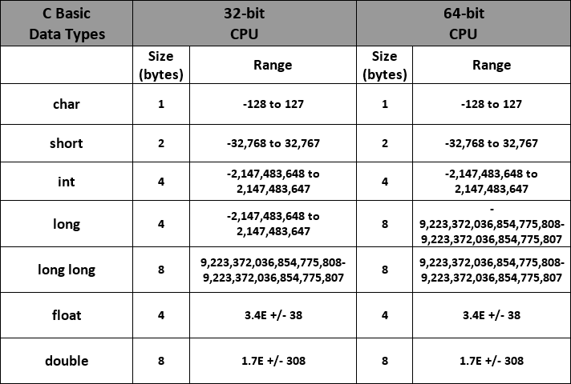
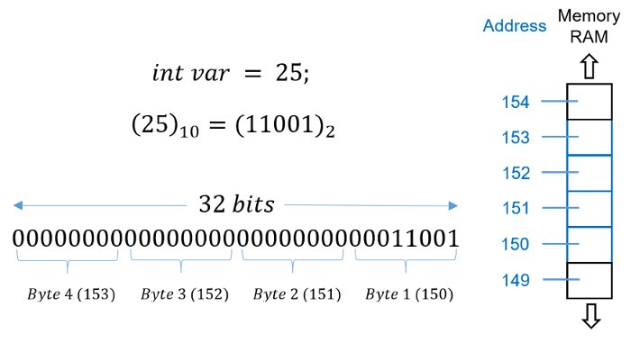

## 자료형



#### 숫자

- 파이썬은 정수형으로 int만 제공 / 버전 2까지 long 제공 
- 버전 2.4 부터는 int가 충분하지 않으면 자동으로 long 타입 변경(오버플로 X)
- 버전 3부터는 아예 int 단일형 / 임의 정밀도 지원 / 고정 정밀도 지원안함
- bool은 논리 자료형 / 파이썬에서는 내부적으로 1(True) 과 0(False)로 처리되는 int의 서브 클래스임
- 결국 object > int > bool

```python
>>> True == 1
True
>>> False == 0
True
```

#### 임의 정밀도?

- 임의 정밀도 정수형이란 쉽게 말해 무제한 자릿수를 제공하는 정수형을 말함 
- 정수를 숫자의 배열로 간주 / 단위를 쪼개 배열 형태로 표현

| 사이즈 | 3         |          |      |
| ------ | --------- | -------- | ---- |
| 값     | 437976919 | 87719511 | 107  |

--> (437976919\*2^(30\*0)) + (87719511\*2^(30\*1)) + (107*2^(30\*2)) = 123456789101112131415

- 이처럼 자리수 단위로 구분값을 별로로 계산하여 처리하게 됨
- 임의정밀도로 처리하면 계산 속도가 저하됨 / 그러나 숫자를 단일형으로 처리할 수 있으므로 언어를 매우 단순한 구조로 만들 수 있음 / 기능과 안전을 위해 속도를 맞바꿈

#### 매핑

- 키와 자료형을 구성된 복합 자료형, 파이썬에 내장된 유일한 매핑 자료형은 딕셔너리

#### 집합

- 파이썬의 집합 자료형 set은 중복을 가지지 않는 자료형

```python
# 빈 집합 선언
>>> a= set()
>>> a
set()
>>> type(a)
<class 'set'>
# 빈 집합 아닐때
>>> a = {'a','b','c'} # {}는 딕셔너리오 같지만 키/밸류 형태 아니므로 판단 쉬움
>>> type(a)
<class 'set'>
>>> a = {'a': A, 'b':B,'c':'C'}
>>> type(a)
<class 'dict'>
```

- set은 입력 순서 유지 X, 중복 값은 하나만 유지

#### 시퀀스

- 수열 / 순서가 있는 나열 / str / list
- immutable - str, tuple, bytes

##### str은 값을 변경할 수 있는데?

```python
>>> a = 'abc'
>>> a = 'def'
>>> type(a)
<class 'str'>
# 처음에 a 변수에 할당된 str타입인 abc는 변경된 적이 없다. 불변이다.
# a 변수는 다른 str 타입인 def를 다시 참조 했을 뿐 실제로 abc도 def도 생성 후 
# 변경된 적이 없다. 불변이므로
>>> a = 'abc'
>>> id('abc')
4317530408
>>> id(a)
4317530408
>>> a = 'def'
>>> id('def')
4318831648
>>> id(a)
4318831648
# 또 다르게 확인하는 방법(만약 바꿀수 있다면 한글자씩 변경이 가능할텐데..)
a[1] = 'd' # 이렇게 실행하면 오류뜬다
```

#### 원시타입

- C나 자바같은 언어들은 원시타입을 제공





- 원시 타입은 메모리에 정확하게 타입 크기만큼의 공간을 할당하고 그 공간을 오로지 값으로 채워넣음
- 자바는 원시 타입에 대응되는 클래스 객체를 다음과 같이 지원

```java
Integer a = new Integer(5);
```

- 원시 타입과 대응되는 객체를 갖고있고, 단순히 메모리에 숫자만 보관하고 있을 때는 하지 못했던 일들이 객체로 만들면 가능해짐 (문자로 변환하든지, 16진수로 변환하든지, 시프팅(비트 조작))
- 그러나 여러가지 부가정보 추가되고 메모리 점유율 증가 --> 계산 속도 또한 감소
- 그래서 자바의 int는 32비트(4바이트) 지만 JOL(java object layout) 실행 결과를 보면 객체
  Integer는 128비트(16바이트)나 되버림.
- 실제로 보면 처음 12바이트는 부가정보를 보관하는 헤더로 구성 나머지 4바이트가 값 저장
- bool은 원시타입은 1비트 밖에 안되는데, 객체 Boolean은 무려 128비트 차지
- 객체는 편리하지만 일정 부분 속도와 공간 희생

#### 파이썬은 원시타입 지원 X, 편리한 기능 제공에 우선순위, 속도, 메모리 어느정도 포기

- 객체만 지원(파이썬)
- 원시 타입(C)
- 원시 타입, 객체(자바)

#### 객체

- 파이썬은 모든 것이 객체
- **Immutable Object => bool, int, float, tuple, str**
- 문자와 숫자는 불변객체

```python
>>> 10
>>> a = 10
>>> b = a
>>> id(10), id(a), id(b)
(4393858752, 4393858752, 4393858752)
# 메모리 상에 위치한 객체의 주소를 얻어오는 id()함수를 실행한 결과는 모두 동일
# 변수는 사실 참조하고 있을 뿐(값을 갖고 있는 int와 str은 모두 불변 객체)
# 상수처럼 read-only로 사용하거나 / 값이 변하지 않기 때문에  dict나 set의 키나 값으로 사용함
# list 는 값이 변할 수 있어 dict의 키나 set의 값으로 사용 불가
```

- **mutable Object => list, set, dict**

```python
>>> a = [1,2,3,4,5]
>>> b = a
>>> b
[1, 2, 3, 4, 5]
>>> a[2] = 4
>>> a
[1, 2, 4, 4, 5] # 값이 바뀜
>>> b
[1, 2, 4, 4, 5] # b가 불변객체라면 안바뀌지만 가변객체이기 때문에 참조하는 경우 같이 바뀜
```

#### 속도 

- 파이썬의 객체 구조는 잘 설계됨


- 원시타입은 메모리에서 값을 꺼내 한번 연산하면 끝인 원시타입에 비해 / 파이썬의 객체는 값을 꺼내는 데만 해도 var ->PyObject_HEAD에서 타입코드를 찾는 등 여러 부가작업 필요
- 파이썬의 numpy는 C로 만들어 내부적으로 리스트를 C 원시타입으로 처리 --> 빠름
- 넘파이가 파이썬 리스트보다 40배정도 빠름

#### C++ 참조와 비교

```C++
// C++
int a = 10;
int &b = a;
b = 7;

std::cout << a << std::endl;
// output --> 7
// 참조 변수는 파이썬과 동일하게 참조를 갖음. 참조변수에 값 할당 시 참조의 대상또한 변함
```

```python
>>> a = 10
>>> b = a
>>> id(a), id(b)
(4550522560, 4550522560)
>>> b = 7
>>> a, id(a), id(b)
(10, 4550522560, 4550522464)
# 파이썬은 b는 a를 참조했지만 b에 새로운 값을 할당하면 더이상 b가 a를 참조하지 않음
# b가 다른 id를 가지게 됨 / a = 10 유지
# 그래서 C++ 과 python 참조방식의 차이를 잘 숙지해야함.
```

#### is와 ==

- is는 id()값을 비교하는 함수, **None은 널(null)로서 값 자체가 정의되어 있지 않으므로** ==로 비교 불가능
- 따라서 None은 is로만 비교 가능

```python
if a is None:
    pass
# ==은 값을 비교하는 연산자
a = [1,2,3]
a == a
# True
a == list(a)
# True
a is a
# True
a in list(a) # 값은 동일하나 list로 한 번 더 묶으면, 별로의 객체로 복사, id 달라짐
# False
a == copy.deepcopy(a)
#True
a is copy.deepcopy(a) # 값은 같지만 id가 다름
#False
```

#### 자료구조, 자료형, 추상자료형

- 자료구조란 데이터에 효율적으로 접근하고 조작하기 위한 데이터의 조직, 관리, 저장구조 말함
- 자료형 - 컴파일러 또는 인터프리터에게 프로그래머가 데이터를 어떻게 사용하는지 알려주는 일종의
  데이터 속성(attribute)이다.  / 자료구조보다 구체적 / 특정언어에서 자료형이라 함은 정수, 실수, 문자열
  등 해당언어가 지원하는 원시 자료형까지 포함하는 모든 자료의 유형이다.
- 자료구조 - 일반적으로 원시 자료형을 기반으로 한 배열, 연결리스트, 객체 등을 말하고, 자료형의 관점에서
  여러 원시 자료형을 조합한 자료구조는 복합 자료형이 됨
- 추상자료형(ADT)는 자료형에 대한 수학적 모델을 지칭 / 해당 유형의 자료에 대한 연산을 명기
  활동만을 정의 / 실제 구현 방법은 명시 X / OOP에 대한 경험이 있는 분들이라면 추상화를 떠올리면 이해가 쉬움 / 추상화는 필수속성만 보여주고, 불필요한 정보는 감춤 / 이처럼 인터페이스만 보여주고 실제 구현은
  보여주지 않는 점에서 ADT는 OOP의 추상화와 비슷한 개념
