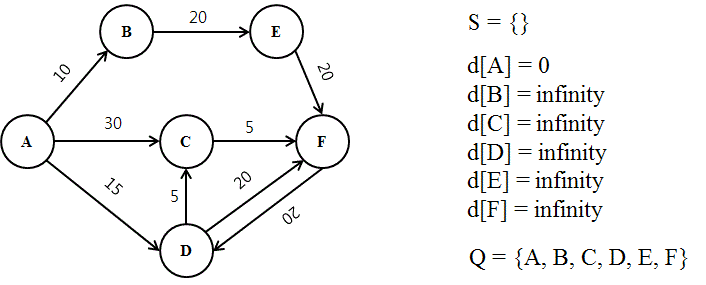
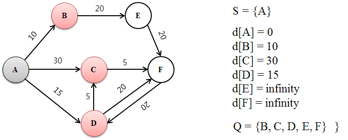
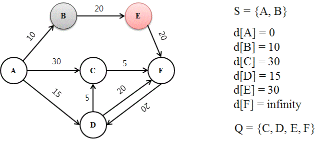
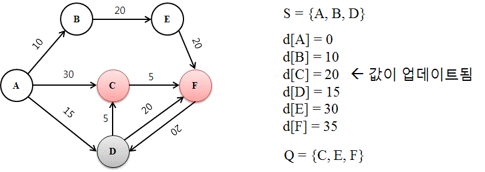
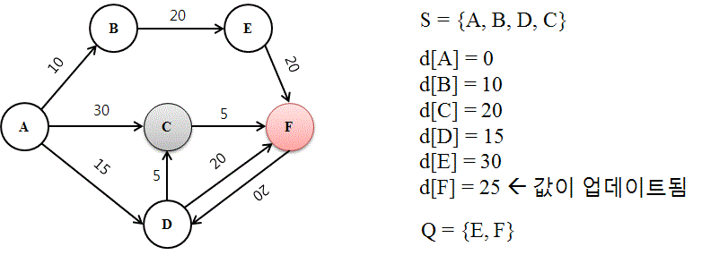

# 최단 경로 문제(다익스트라)

#### 최단 경로 문제는 각 간선의 가중치 합이 최소가 되는 두 정점(또는 노드)사이의 경로를 찾는 문제

- 네비게이션
- 교차로 vertax 간선 edge, 가중치 weight - 거리나 시간과 같은 이동 비용

- 다익스트라 알고리즘은 항상 노드 주변의 최단 경로만을 택하는 대표적인 그리디 알고리즘, BFS
- DFS(미로찾기), BFS(사람이 서로 다른 갈림길로 흩어져 길 찾기)
- 가중치가 음수인 경우 c처리 못함 / 음수 가중치 계산 가능 -> 벨만 포드
- BFS시 우선순위 큐 적용하여 O((v+e)logv) 가능하고 / 모든 정점이 출발지와 연결되어있으면 O(elogv)로 가능

예를 들어, 다음과 같은 네트워크가 존재한다고 가정하자. 먼저, A 라우터의 목표는 F까지의 최단 거리 계산이며, 수단으로는 다익스트라 알고리즘을 활용한다. 이때, 각 데이터의 의미는 다음과 같다.

- S = 방문한 노드들의 집합
- d[N] = A → N까지 계산된 최단 거리
- Q = 방문하지 않은 노드들의 집합

### 다익스트라 그림설명(나무위키)

**1. 다익스트라 알고리즘은 아직 확인되지 않은 거리는 전부 초기값을 무한으로 잡는다.**!

초기화가 실행된 후의 그래프.

- 출발지를 A로 초기화했기 때문에, 출발지와 출발지의 거리는 방문할 필요도 없이 당연히 0 값을 가진다. 즉, d[A]=0이 된다. (A노드를 방문한 것은 아니다.)
- 출발지를 제외한 모든 노드들도 아직 방문하지 않았기에, d[다른 노드]=*무한*이 된다.
- Q는 방문하지 않은 노드들의 집합이므로, 초기화할 때는 모든 노드들의 집합이 된다.
- S는 공집합 상태이다.


**2. 루프를 돌려 이웃 노드를 방문하고 거리를 계산한다.**



첫 루프를 마치고 난 뒤의 그래프.

- 루프의 시작은 거리가 최소인 노드(d[N]이 최소값인 노드 N)를 Q(방문하지 않은 노드의 집합)에서 제거하고, 그 노드를 S(방문한 노드의 집합 및 최소 경로)에 추가한다. 즉, N을 '방문한다'는 의미이다.
- 이후, 모든 이웃 노드와의 거리를 측정하여 d[N](=출발지로부터 N까지 계산된 최소 거리값) + (N과 이웃 노드 간의 거리값) = (출발지부터 이웃 노드까지의 거리값)이 계산된다.
- 다만, 지금은 첫 번째 루프만을 끝낸 상태이므로, 단순히 0 + (이웃 노드와 출발지 사이의 거리값) = (출발지와 이웃 노드 간의 거리값)이 각 이웃 노드에 기록된다. 따라서, d[B] = 10, d[C] = 30, d[D] =15로 값을 변경한다.


**3. 첫 루프 이후의 그래프의 상태가 업데이트되는 방식**




두 번째 루프를 마치고 난 뒤의 그래프.

이제 루프가 반복적으로 작동하는 방법을 설명한다. 밑의 그림들 또한 루프 안에서 알고리즘이 진행되는 순간들을 반복 설명한다.

- 이전에 설명했듯이, 방문할 노드는 Q에 남아있는 노드들 중 d[N] 값이 제일 작은 것으로 선택된다. 따라서, Q = {B, C, D, E, F} 중 B가 d[B] = 10으로 제일 작은 값을 가지므로, B를 방문하여 S에 추가하고 Q에서 제거한다.
- 이제, B의 이웃 노드들을 모두 탐색하여 거리를 재고 d[N]에 기록한다. B의 이웃 노드는 E뿐이므로, d[E] 값이 무한에서 d[B]+(B와 E 사이의 값 20) = 30 으로 업데이트된다.[[11\]](https://namu.wiki/w/다익스트라 알고리즘#fn-11) 여기서 d[B] 값을 더하는 이유는 **출발지부터의** 거리값을 재기 위해서다.


**4. 더 빠른 경로를 발견한 경우**




- 3번째 그림에서 설명했듯이, 이번에 선택·방문되는 노드는 D이다. Q의 원소 중에서 제일 낮은 d[N] 값을 가지고 있기 때문이다. 그래서, S에 D가 추가되어 있다.
- 이제 D의 이웃 노드들(C, F)의 거리를 잰 후, d[N]값을 업데이트한다. 특별한 상황은 d[C]의 값이 A를 방문할 때 이미 계산되어 30으로 정해져 있었으나, D를 방문하여 C와의 거리를 확인해 보니 20으로 **더 짧은 최단 경로가 발견되었다!** 그러므로, d[C]의 값을 30에서 20으로 변경한다.
- d[F]의 경우는 원래의 값이 무한이므로, 더 작은 값인 15+20=35로 변경한다.


**5. 또 다른 반복 루프 상황**

!

- Q = {C,E,F}에서 d[C] = 20으로 C를 방문하여, S는 {A, B, D, C}가 되었다.
- 다시 이웃 노드와의 거리 계산을 해보니, 이번에는 (A→D) + (D→F) = 15 + 20 = 35보다, (A→D) + (D→C) + (C→F) = 15 + 5 + 5 = **25**로 더 작은 값을 가지는 것이 발견되었다. d[F] = 25로 업데이트한다.


이 일련의 과정이 반복되어 Q가 공집합이 되었다면, 남아 있는 데이터로 추론하여 최단 거리를 결정한다.

마지막 루프 이후,

- S = {A, B, D, C, F, E} (방문한 순서대로 정렬)
- d[A] = 0
- d[B] = 10
- d[C] = 20
- d[D] = 15
- d[E] = 30
- d[F] = 25
- Q = ∅


목적지가 F였으므로, A→D→C→F가 최단 경로이며, 거리는 25로 결정된다.

```python
# 다익스트라 수도코드(우선순위 큐 사용)
function dijkstra(Graph, source):
    dist[source] <- 0 # init
    
    create vertax priority queue Q
    
    for each vertax v in Graph.Vertices:
        if v != source
        	dist[v] <- inf # Unknown distance from source to v
            prev[v] <- undefined # predecessor of v
            
        Q.add_with_priority(v, dist[v])
        
    while Q is not empty: # The main loop
        u <- Q.extract_min() # Remove and return best vertax
        for each neighbor v of u: # only v that are still in Q
			alt <- dist[u] + Graph.Edges(u, v)
            if alt < dist[v]
            	dist[v] <- alt
                prev[v] <- u
                Q.decrease_priority(v, alt)
                
    return dist, prev      
```

