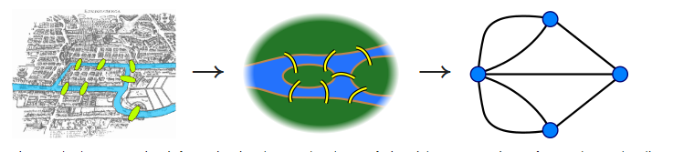
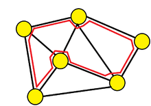
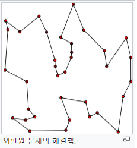
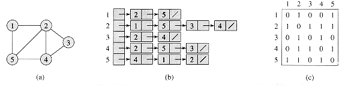
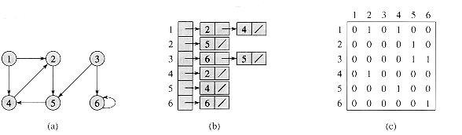
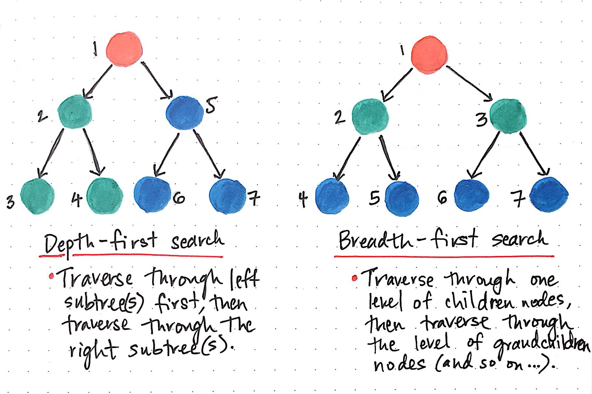

# 그래프

#### 객체의 일부 pair들이 연관되어 있는 객체 집합 구조

#### 오일러 경로



모든 정점이 짝수 개의 차수를 가지면 모든 다리를 한 번씩만 건너서 도달하는 것 가능(한붓그리기)

#### 해밀턴 경로

- 각 정점을 한 번씩 방문한는 무향 또는 유향 그래프 경로



#### 오일려 경로는 path를 간선(edge)를 기준으로 하고 해밀턴 경로는 정점(vertax)를 기준으로함, 해밀턴경로를 찾는 문제는 최적 알고리즘이 없는 NP-complete(np-난해)문제이다.

#### 원래의 출발점을 돌아오는 경로는 특별히 Hamiltonian Cycle이라 하고, 이 중 최단경로를 찾는 문제는 외판원 문제(Traveling salesman Problem)로 유명



- 브루트포스 솔루션(O(n!)), 다이나믹 프로그래밍 (O(n^2*2^n))

#### 그래프 순회

- 그래프 탐색, 그래프의 각 정점을 방문하는 과정
- DFS, BFS
- DFS가 널리 쓰임, 스택 or 재귀로 구현, 백트래킹에 활용
- BFS는 큐로 구현, 그래프의 최단겨로 문제 등
- 그래프를 표현하는 방법 - 인접 matrix, 인접 list
- 
- 
- 

#### DFS(Depth First Search)

- 재귀를 이용한 방법

```pseudocode
DFS(G, v)
	▷ v 방문 했다.
	label v as discovered
	▷ v 정점의 모든 directed 간선들을 반복
	for all directed edges from v to w that are in G.adjacentEdges(v) do
		▷ 아직 방문하지 않는 정점에 대해서 DFS 호출
		if vertax w is not labeled as discovered then 
			recursively call DFS(G, w)
```

```python
def recursive_dfs(v, discovered = []):
    discovered.append(v)
    for w in graph[v]:
        if w not in discovered:
            discovered = recursive_dfs(w, discovered)
   	return discovered
```

- 스택을 이용한 방법

```pseudocode
DFS-iterative(G, v)
	let S be a stack ▷ 스택 S 선언
	S.push(v) ▷ v push
	while S is not empty do ▷ 스택이 빌 때 까지 돌림
		v = S.pop() ▷ v 꺼내고
		if v is not labeled as discovered then ▷ v가 아직 탐색된 것이 아니라면
			label v as discovered ▷ v 탐색됐다고 하고
			for all edges from v to w in G.adjacentEdges(v) do ▷ v 인접 간선 모두 추출 후
				▷ 도착 점 w push
				S.push(w)
```

```python
def iterative_dfs(start_v):
    discovered = []
    stack = [start_v]
    while stack:
        v = stack.pop()
        if v not in discovered:
            discovered.append(v)
            for w in graph[v]:
                stack.append(w)
    return discovered
```

- 스택이 좀 더 직관적이고 실행속도도 빠르다.
- 재귀는 사전식 순서로 방문, 스택은 역순으로 방문

### BFS(Breadth First Search)

- 큐를 이용한 반복 구조로 규현 / 다익스트라 알고리즘에 쓰임

```ps
BFS(G, start_v)
	let Q be a queue ▷ 큐 선언
	label start_v as discovered ▷ 스타트 지점 방문
	Q.enqueue(start_v) ▷ 큐에 스타트 지점 넣고
	while Q is not empty do ▷ 큐가 빌 때까지 돌림
		v := Q.dequeue() ▷ 큐에서 빼고
		if v is the goal then ▷ 만약 뺀 v 가 도착점이면 스톱 리턴
			return v
        for all edges from v to w in G.adjacentEdges(v) do ▷ 아니면
        	▷ v에 모든 인접간선으로 이어진 w에 대해서
        	if w is not labeled as discovered then ▷ w를 방문하지 않았으면
        		label w as discovered ▷ 방문하고
        		w.parent := v ▷w의 부모는 v
        		Q.enqueue(w) ▷ w 집어넣음
▷ 수도코드 := (assignment)
```

```python
def iterative_bfs(start_v):
    discovered = [start_v]
    queue = [start_v]
    while queue:
        v = queue.pop(0)
        for w in graph[v]:
            if w not in discovered:
                discovered.append(w)
                queue.append(w)
    return discovered
```

- bfs 는 재귀로 동작하지 않음, 큐를 이용한 반복구현만 가능

#### 백트래킹

- 해결책에 대한 후보를 구축해 나아가다 가능성이 없다고 판단되는 즉시 후보를 포기(backtrack(되짚어가다, 철회하다))해 정답을 찾아가는 알고리즘
- 백트래킹은 DFS보다 넓은 의미, 탐색을 하다가 더 갈 수 없으면 길을 되돌아가 다른 길을 찾음
- 백트래킹의 골격이 DFS
- 최악의 경우는 모든 경우를 다 거침(브루트 포스와 유사) / 하지만 가능성없을때 후보 바로 포기 -> BF보단 우아함
- 가능성 없는 후보를 포기 -> 트리의 불필요한 부분 버림 --> 가지치기
- 제약 충족 문제

#### 제약 충족 문제

- Constraint Satisfaction Problems(CSP)에 필수적인 알고리즘이 백트래킹
- 인공지능이나 경영 과학 분야, 스도쿠 등, 8퀸, 십자말 풀이, 4색 문제

### 실습파일 참조..

#### 중첩 함수(Nested Function) 

- 함수 내에 위치한 또 다른 함수, 부모 함수의 변수를 자유롭게 읽을 수 있음 / 코테에서는 자주 쓰임
- 매번 파라미터를 전달하지 않아도 되기 때문에 구현이 깔끔해짐
- 가변 객체의 경우 여러가지 연산 조작 가능
- 하지만 재할당(=) 사용시 로컬 변수로 되어버린니 주의
