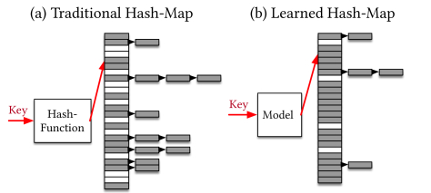
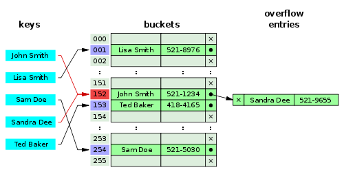
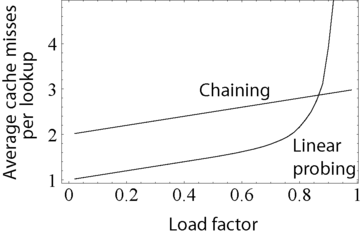

# 해시 테이블

#### 해시 테이블 또는 해시 맵은 키를 값에 매핑할 수 있는 구조인, 연관 배열 추상자료형(ADT)을 구현하는 자료구조

- 대부분의 연산이 분할 상환 분석에 따른 시간 복잡도가 O(1)
- 데이터 양에 관계 없이 빠른 성능 기대
- 한스 피터 룬이 사내 메모에서 해싱과 체이닝을 결합하여 처음 사용

### 해시

- 해시 함수란 임의 크기 데이터를 고정 크기 값으로 매핑하는 데 사용할 수 있는 함수
- 해시 테이블의 핵심은 해시함수

```python
ABC -> A1
1324BC -> CB
AF32B -> D5
```

화살표의 역할이 해시함수

- 해시 테이블을 인덱싱하기 위해 해시함수를 사용하는 것이 Hashing / 정보를 가능한 한 빠르게 저장하고 검색하기 위해 사용하는 중요한 기법
- 해싱은 최적의 검색이 필요한 분야에 사용 / 심볼 테이블 등의 자료구조, Checksum, 손실함수, 무작위화 함수, 암호 등과도 관련

#### 성능 좋은 해시 함수들의 특징

- 해시 함수 값 충돌의 최소화

- 쉽고 빠른 연산
- 해시 테이블 전체에 해시 값이 균일하게 분포
- 사용할 키의 모든 정보를 이용해 해싱
- 해시 테이블 사용 효율이 높을 것

##### 생일 문제(해시 함수 값 충돌의 최소화)

- 생일이 같은 2명이 존재할 확률은 상식과 다르게 23명일때 50%, 57명이 모이면 99%이다.

```python
# 생일 문제 증명
import random

trials = 100000 # 10만번
same_birthdays = 0 # 생일이 같은 실험의 수

# 10만 번 실험 진행
for _ in range(trials):
    birthdays = []
    # 23명이 모였을 떄, 생일이 같을 경우 same_birthdays += 1
    for i in range(23):
        birthday = random.randint(1, 365)
        if birthday = in birthdays:
            same_birthdays += 1
            break
        birthdays.append(birthdays)
        
print(f'{same_birthdays / trials * 100}%')
# 50.708%
```

##### 비둘기집 원리 

 n개의 아이템을 m개 컨테이너에 넣을 때, n > m 이라면 적어도 하나의 컨테이너에는 반드시 2개 이상의 아이템이 들어 있다는 원리 / 1834년 수학자 페터 디리클레가 만든 서랍원리 / 귀류법으로 모순을 이끌어내 쉽게 증명 가능


비둘기집 원리에 따라 9개 공가이 있는 곳에 10개의 아이템이 들어오면 반드시 1번 이상은 충도링 발생 / 좋은 해시 함수라면 최소화하면 1번의 충돌만 나겠지만, 좋지 않은 해시 함수의 경우 심하면 9번 모두 충돌할 수도 있다. 여러번 충돌한다는 것은 그만큼 추가 연산이 필요 -> 피하는 것이 좋음

##### 로드 팩터

로드 팩터란 해시 테이블에 저장된 데이터 개수 n을 버킷의 개수 k로 나눈 것이다.

`load factor = n/k `

- 로드 팩터 비율에 따라서 해시 함수를 재작성해야 될지 또는 해시 테이블의 크기를 조정할지 결정
- 해시 함수가 키들을 잘  분산해 주는지 말하는 효율성 측정에서도 사용
- 자바 10에서 `시간과 공간 비용의 적절한 절충안`으로 로드 팩터 0.75 정함
- 일반적으로 로드 팩터가 증가할수록 해시 테이블의 성능 점점 감소

##### 해시함수


해시 함수를 통해 키가 해시 값으로 변경되는 과정

- 해시 테이블을 인덱싱하기 위해 해시 함수를 사용하는 것을 해싱

- 다양한 알고리즘 존재 / 데이터에 따라 제각각 

- 정수형 해싱 기법 - 모듈로 연산을 이용한 나눗셈 방식
  `h(x)  = x mod m`
  입력값 x , m 은 해시테이블의 크기, 일반적으로 2의 제곱수에 가깝지 않은 소수를 택함
  매우 단순하지만 실무에서는 이미 많은 키 세트가 충분히 랜덤함, 키 세트가 어떤 소수에 의해 순환 구조가 될 확률은 매우 낮아 실제로 잘 작동

  x는 어떤 간단한 규칙을 통해 만들어낸 충분히 랜덤한 상태의 키 값
  조슈아 블로크는 P(x)  = s[0] * x^(n-1) +  s[1] * x^(n-2) + ... + s[n-1]

  여기서 x를 31로 하는 거듭제곱 P(31)의 연산으로 정의했다고 밝힘 / 문자열 s에 대한 해시 값 구성
  이 값은 RISC머신에서 가장 저렴한 계산 비용, 소수 31을 매직 넘버로 택함
  이 정도로 간단한 형태가 성능과 충돌의 적절한 합의점이였음

  실제로 31은 메르센 소수(2의 거듭제곱에 1이 모자란 수)로 신비한 성질을 가져 나쁘지 않은 선택

- 구글은 해시 함수를 딥러닝으로 학습한 모델을 적용해 충돌을 최소화하는 논문을 발표



#### 충돌

##### 개별 체이닝(충돌 시 처리방식)



Separate Chaining

- 개별 체이닝은 충돌 발생 시 연결 리스트로 연결하는 방식 / 단순하므로 인기 많은
- 원래 해시 테이블 구조의 원형이기도 하며 가장 전통적인 방식, 흔히 해시테이블이라고 하면 이방식
- 1. 키의 해시 값을 계산 / 2. 해시 값을 이용해 배열의 인덱스를 구한다. / 3. 같은 인덱스가 있다면 연결리스트로 연결

- 잘 구현하면 탐색 O(1), 모든 충돌 발생시 O(n) / 자바 8에서는 연결 리스트 구조를 좀 더 최적화해 데이터의 개수가 많아지면 레드-블랙 트리에저장하는 형태로 변환(레드 블랙 트리 - 자가 균형 이진 탐색 트리)

##### 오픈 어드레싱


- 충돌 발생 시 탐사를 통해 빈 공간을 찾아나서는 방식

- 체이닝과 달리 전체 슬롯의 개수 이상은 저장 불가능 / 모든 원소가 반드시 자신의 해시값과 일치하는 주소에 저장된다는 보장 X

- 오픈어드레싱 중 가장 간단한 선형 탐사 방식은 충돌이 발생 시 해당 위치부터 순차적으로 탐사 진행
- 탐사를 진행하다가 비어 있는 공간 발견하면 삽입 / 문제는 해시 테이블에 저장되는 데이터들이 고르게 분포되지 않고 뭉치는 경향, 클러스터링
- 버킷 사이즈보다 큰 경우 삽입 X, 기준 로드팩터를 넘어서면 그로스 팩터의 비율에 따라 더 큰 크기의 또 다른 버킷을 생성한 후 여기에 새롭게 복사하는 리해싱일어남 / 동적 배열에서의 더블링과 비슷

- 1953년 피터 룬의 해시 테이블은 개별 체이닝 방식 / 1954년 암달의 법칙(진 암달)에 의해 오픈 어드레싱 발명

##### 언어별 해시 테이블 구현 방식

- 파이썬 : 딕셔너리 / 오픈 어드레싱(체이닝 시 malloc으로 메모리를 할당하는 오버헤드가 높아 오픈 어드레싱 택함) / 연결 리스트를 만들기 위해서는 추가 메모리 할당 필요, 추가 메모리 할당은 느린 작업
- 
- 선형 탐사 방식은 일반적으로 체이닝에 비해 성능 좋음 / but 로드팩터이상 저장 불가 
- 그래서 루비나 파이썬 같은 언어는 로드팩터를 낮게 잡아 성능 저하 문제를 해결
- 파이썬 로드 팩터 0.66 루비 0.5
- C++, 자바, go 는 개별 체이닝 사용

#### 실습파일 참조..

### zip() 함수

- zip()함수는 2개 이상의 시퀀스를 짧은 길이를 기준으로 일대일 대응하는 새로운 튜플 시퀀스를 만드는 역할

```python
a = [1, 2, 3, 4, 5]
b = [2, 3, 4, 5]
c = [3, 4, 5]
zip(a, b)
<zip object at 0x0000002A13F54EFC0> # 제너레이터 반환
list(zip(a,b))
# [(1, 2), (2, 3), (3, 4), (4, 5)]
list(zip(a, b, c))
# [(1, 2, 3), (2, 3, 4), (3, 4, 5)]
# 튜플 시퀀스라 값을 변경하는 것이 불가능
```

#### 아스테리스트(*)

- zip()의 파라미터는 1개가 될 수도 있고, 2개가 될수도, 10개가 될 수도 있다.
- 여기에 Asterisk 혹은 별표를 활용(C의 포인터와 다름) / *(unpack) , 시퀀스 언패킹 연자, 주로 튜플이나 리스트를 풀어 헤치는 데 사용
- 함수의 파라미터가 되었을 때도 반대로 패킹(*)

```python
fruits = ['lemon', 'pear', 'watermelon', 'tomato']
print(*fruits)
# lemon pear watermelon tomato
def f(*params):
    print(params)
f('a', 'b', 'c')
# ('a', 'b', 'c') # 이는 print의 기본 동작 원리이기도 하다

# 몇 개의 파라미터를 넘기든, 모두 처리가 된다.
a, *b = [1, 2, 3, 4]
a # 1
b # [2, 3, 4]
*a, b = [1, 2, 3, 4]
a # [1, 2, 3]
b # 4

```

- 변수의 할당 또한 이렇게 *로 묶어서 처리할 수 있다. 일반적인 변수는 값을 하나만 취하지만 *로 취하면 나머지 모든 값을 취하게 된다.
- **의 경우 키/값 제어를 언패킹하는데 사용된다.

```python
date_info = {'year' : '2020', 'month' : '01', 'day' : '7'}
new_info = {**date_info, 'day' : "14"} # day 14는 업데이트
new_info 
# {'year': '2020', 'month': '01', 'day': '14'}

```


