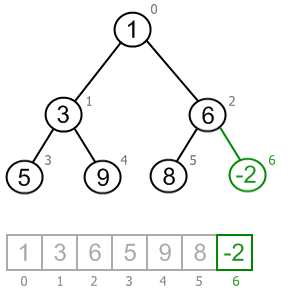
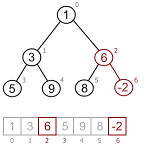
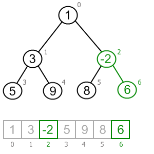
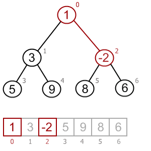
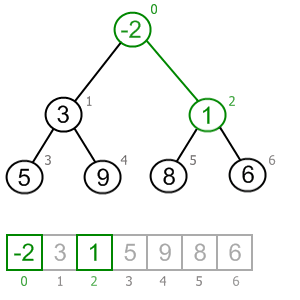
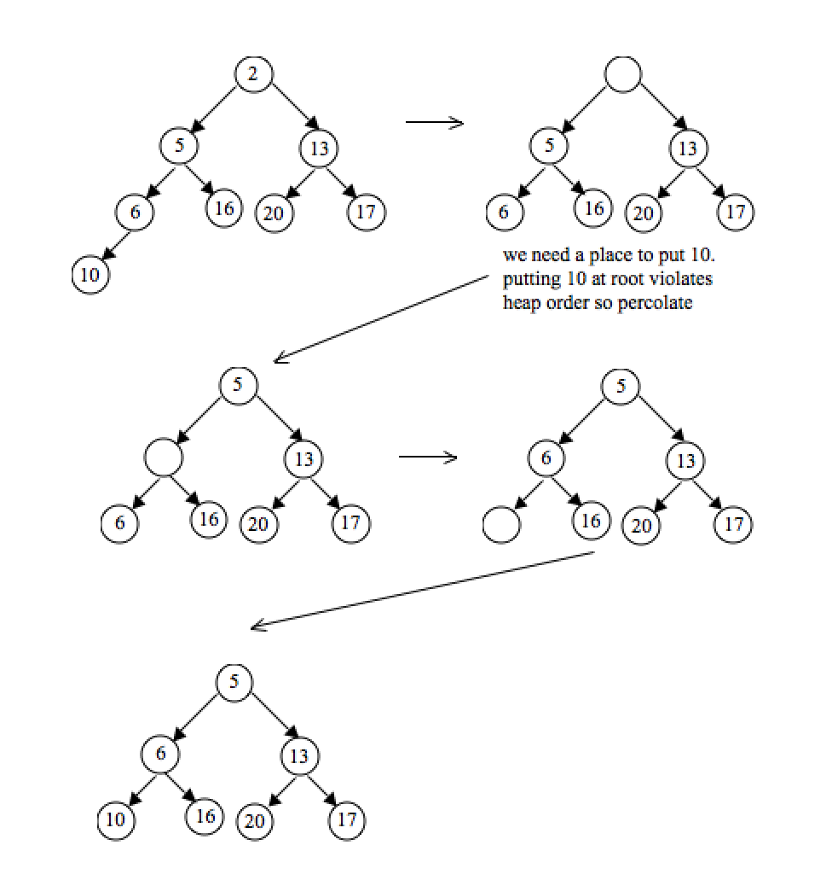

# 힙(heap)

- 여러 개의 값 중에서 가장 크거나 작은 값을 빠르게 찾기 위해 만든 이진 트리
- heap: 무언가를 차곡차곡 쌓아올린 더미라는 영단어 뜻
- **항상 완전 이진 트리**
- 부모의 값은 항상 자식의 값보다 크거나(Max heap), 작아야(Min heap)하는 규칙이 있다. 따라서 루트노트에는 항상 데이터들 중 가장 큰 값이 저장되어 있기 때문에, 최댓값을 O(1)안에 찾음

- 단순히 최댓값을 O(1)안에 찾기 위해서라면 '항상 완전 이진 트리의 형태여야 한다'는 조건 만족할 필요 없음
- 파이썬은 최소 힙만 구현되있음
- 부모 노드가 더 작거나 크기만 하지, sibling간의 정렬은 안되있음.(상하관계만 있음)
- J. W. J Williams

****

#### 데이터의 삽입 삭제 -> O(logN)

#### 삽입

#### 1. 가장 끝자리에 노드 삽입

#### 2. 그 노드와 부모 노드를 서로 비교

### 3. 규칙에 맞으면 두고, 아니면 교환

#### 4. 반복

#### 제거

##### 1. 루트노드 제거

##### 2. 루트 자리에 가장 마지막 노드 삽입

##### 3. 올라간 노드와 그의 자식 노드와 비교

##### 4. 조건에 만족하면 그대로 두고, 아니면 자식과 교환

##### 5.  반복

#### 표현

- 배열로 표현하기 매우 좋다. 배열 낭비없이 배치가능
- 보통 index 1부터 사용
- 깊이는 1, 2, 4, 8 .... / 부모는 (i-1)/2,  왼쪽 자식 2i, 오른쪽 자식 2i + 1

#### 응용분야

- 힙의 루트가 항상 최댓값이거나 최솟값
- 이를 이용해 우선순위 큐나 힙 정렬을 만들 수 있다.
- 무손실 압축 알고리즘 허프만 코드도 힙의 구조 기반이다.
- 항상 균형을 유지하는 특징 --> 다익스트라, 우선순위 큐
- 힙 덕분에 다익스트라 O(n^2) -> O(E log V)
- 최소 신장 트리를 구현하는 프림 알고리즘, 중앙값의 근사값 등