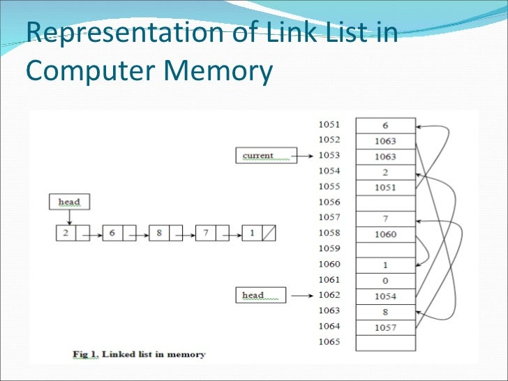
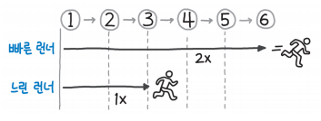

# 연결 리스트

- 연결 리스트는 데이터 요소의 선형 집합으로, 데이터의 순서가 메모리에 물리적인 순서대로 저장되지는 않는다.

- 대표적인 선형 자료구조 / 추상 자료형의 기반 / 새로운 노드 삽입이나 삭제 간편 
- 물리메모리 연속적으로 사용 X / 데이터를 구조체로 묶어서 포인터로 연결 --> 다양하게 활용

- 연결 리스트는 배열과 달리 특정 인덱스에 접근하기 위해서 전체를 순서대로 읽어줘야함 O(n)
- 그러나 시작 점이나 끝 지점에 아이템을 추가하거나 삭제, 추출하는 작업은 O(1)에 가능하다.
- 1955년 Allen Newell이 동료들과 함께 만든 언어 IPL의 기본 자료구조로 처음 사용, 75년 튜링상
- 이를 이용해 컴퓨터 체스 프로그램을 비롯한 몇 가지 인공지능 프로그램 개발됨
- 인공지능 연구에 사용되는 LISP(LIST Programming)언어에 영향을 미침(LISP의 주요 자료구조 링크드리스트)

#### 실습파일 참고...

#### 런너 기법

- 런너는 연결 리스틀르 순회할 때 2개의 포인터를 동시에 사용하는 기법. 한 포인터가 다른 포인터보다 앞서게 하여 병합 지점이나 중간 위치, 길이 등을 판별할 때 유용
- 
- 빠른러너가 마지막에 도달하면 느린 러너는 정확히 중간 지점 가리키게됨 --> 이런식으로 중가점 찾음
- 여기서 부터는 값을 비교하거나 뒤집기를 시도하는 등 여러방식 활용 가능