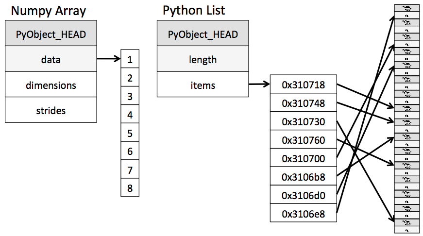

# 리스트, 딕셔너리

### 리스트 - 순서대로 저장하는 시퀀스, 변경 가능한 목록

- 입력순서가 유지됨, 동적배열로 구현됨

| 언어   | 동적 배열   |
| ------ | ----------- |
| 파이썬 | list()      |
| C++    | std::vector |
| 자바   | ArrayList   |

- 스택과 큐에서 사용 가능한 모든 연산 함께 제공 --> 코딩테스트에서 유리

- C의 경우는 다용도 자료형 제공 X

- `append()`나`pop()`은 O(1)으로 실행가능하다.

- 첫 번째 요소를 추찰하는 pop(0)은 O(n)이다. --> 리스트에 주로 큐 연산을 사용할 때는 주의가 필요

  

- 리스트의 연산 시간 복잡도

```python
# 선언 방법
a = list()
a = []
# 초기값 지정해 선언하거나, 요소 추가 가능
a = [1, 2, 3]
a.append(4)
a
# [1, 2, 3, 4]
a.insert(3,5) # a.insert(index, value) --> 해당 index에 value 삽입
a
# [1,2,3,5,4]
# 숫자 외에도 다양한 자료형을 삽입할 수 있다.
a.append('안녕')
a.append(True)
a
# [1, 2, 3, 5, 4, '안녕', True]
# 다른 언어의 경우 동적 배열에 삽입할 수 있는 자료형을 동일한 타입으로 제한하는 경우가 있음
# 값을 꺼내올 때
a[3]  # 5
# 슬라이싱, 특정 범위 내의 값을 매우 편리하게 가져옴
a[1:3] # [2,3]
# 다른 언어들은 인덱스의 반복문 구성해야함
# 3번째 파라미터 step 부여
a[1:4:2] # [2,5]
# 존재하지 않은 인덱스 조회시 --> IndexError --> try except문으로 예외처리 가능
try:
    print(a[9])
except IndexError:
    print('존재하지 않는 인덱스')
# 리스트에서 요소 삭제하는 방법 --> 인덱스로, 값으로
# 인덱스로 --> del()
a = [10, 100, 150]
del a[1]
a # [1, 150]
# 값으로 --> remove()
a.remove(1)
a # [150]
# pop() 사용시 스택의 팝처럼 추출로 처리 --> 1.삭제될 값 리턴하고 2.삭제 진행
a.pop(150)
150
a # []    
```

### 리스트의 특징

- 파이썬 리스트는 연속된 공간에 요소를 배치하는 배열의 장점과 다양한 타입을 연결해 배치하는 연결 리스트의 장점을 모두 취한 듯한 형태를 뜀

```c
# 리스트 정의 헤더파일
typedef struct{
    PyObject_VAR_HEAD
    PyObject **ob_item;
    Py_ssize_t allocated;
} PyListObject;
```

- Cpython에서 리스트는 요소에 대한 포인터 목록(ob_item)을 갖고 있는 구조체로 선언되어있다. 리스트에 요소를 추가하거나 조작하기 시작하면 ob_item의 사이즈를 조절해 나가는 형태
- 리스트는 객체로 되어 있는 모든 자료형을 다음과 같이 포인터로 연결
- **그림처럼 객체에 대한 포인터 목록을 관리하는 형태** / 사실상 연결리스트에 대한 포인터 목록을 배열 형태로 관리
- 그래서 단일 리스트에 제각기 다양한 타입을 동시에 관리하는게 가능함
- 매우 편리하나 / 객체에 대한 참조로 구현했기에 인덱스를 조회하는데도 모든 포인터의 위치를 찾아가
  타입 코드를 확인하고 일일이 봐야하는 등의 추가작업 발생 / 속도를 희생함

### 딕셔너리 - 키/값 구조로 이뤄진 딕셔너리

- 파이썬 3.7+ 에서는 입력 순서가 유지됨 / 내부적으로는 해시테이블로 구현

| 언어   | 해시 테이블        |
| ------ | ------------------ |
| 파이썬 | dict()             |
| C++    | std::unordered_map |
| 자바   | HashMap            |

- 파이썬의 딕셔너리는  해시할 수만 있다면 숫자뿐 아니라, 문자, 집합, immutable 객체까지 모두 키로 사용가능 / 이 과정을 해싱 / 해시 테이블을 이용해 자료를 저장
- 입력과 조회가 O(1)로 가능 / 최악의 경우는 O(n)
- 
- 딕셔너리 주요 연산 시간 복잡도 / 대부분의 연산이 O(1)로 매우 우수
- 3.7 부터는 내부적으로 인덱스를 이용해 입력순서 유지하도록 개선됨
- 3.6+ : 딕셔너리 메모리 사용량 20% 감소(성능개선)
- `collections`모듈도 유용함

```python
# 딕셔너리 선언 방법
a = dict()
a = {}
#
a = {'key1': 'value1', 'key2': 'value2'}
a # {'key1': 'value1', 'key2': 'value2'}
a['key3'] = 'value3'
a # {'key1': 'value1', 'key2': 'value2', 'key3': value3}
# 존재하지 않는 키를 조회할 경우에는 에러남 KeyError -> 리스트와 마찬가지로 try-except 예외처리로
# 처리가능
# 딕셔너리에 있는 키/값은 for 반복문으로도 조회가 가능
for k,v in a.items():
    print(k,v)
# key1 value1
# key2 value2
# key3 value3
# 딕셔너리 키는 del로 삭제
del a['key1']
a
{'key2': 'value2', 'key3': 'value3'}
```

#### 딕셔너리 module

- 딕셔너리와 관련된 특수한 형태의 컨테이너 자료형 **defaultdict, Counter, OrderedDict**
- **defaultdict** 객체는 존재하지 않는 키 조회 시, 에러메세지 대신 디폴트 값을 기준으로 해당 키에 해당하는 딕셔너리 아이템 생성 / 실제로 collections.defaultdict 클래스 가짐

```python
a = collections.defaultdict(int)
a['A'] = 5
a['B'] = 4
a # defaultdict(<class 'int'>, {'A': 5, 'B': 4})
a['C'] += 1
a # defaultdict(<class 'int'>, {'A': 5, 'B': 4, 'C': 1}) # 디폴트 값이 0임

```

- **Counter** 객체는 아이템에 대한 개수를 계산해 딕셔너리로 리턴

```python
a = [1,2,3,4,5,5,5,6,6]
b = collections.Counter(a)
b # Counter({5: 3, 6: 2, 1: 1, 2: 1, 3: 1, 4: 1})
type(b) # <class 'collections.Counter'>
# 딕셔너리를 한 번 더 래핑한 collections.Counter 클래스를 가진다.
# 개수를 자동으로 계산해주기 때문에 매우 편리하며, 여려 분야에서 다양하게 활용
b.most_common(2) #[(5, 3), (6, 2)] # b.most_common(요소 몇 개까지 추출할지?)

```

- **OrderedDict** 객체는 파이썬 3.6 이하에서 딕셔너리의 입력 순서가 유지되지않아, 입력 순서가 유지되는 OrderedDict 객체를 제공했음

```python
collections.OrderedDict({'banana': 3,'apple': 4, 'pear': 1, 'orange':2})
# OrderedDict([('banana': 3),('apple': 4), ('pear': 1), ('orange':2)])
```

- 그러나 3.7 버전부터 유지되어서 사용할 필요가 사실상 없음

#### 파이썬도 타입 선언

```python
a = list()
type(a) # <class 'list'>
type([]) # <class 'list'>
type(()) # <class 'tuple'>
type({}) # <class 'dict'>
type({1}) # <class 'set'>
```

