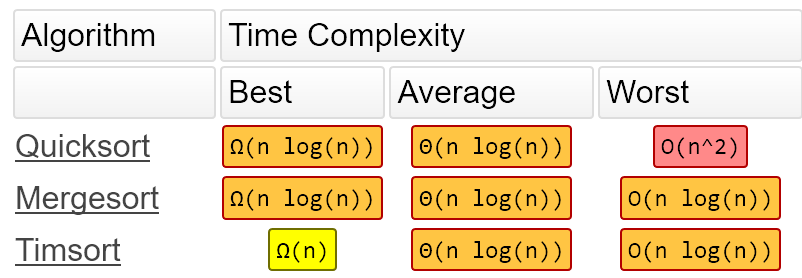

# 문자열 조작

- 원래 문자열은 로우 레벨에서 조작하거나, C처럼 문자형이 따로 없는 언어에서는 조작이 매우 까다로무
- 그러나 대부분의 언어는 별도의 문자열 자료형과 다양한 기능 제공
- 정보 처리 분야 : 어떤 키워드로 웹 페이지르 탐색할 때 문자열 처리 애플리케이션 이용
- 통신 시스템 : 문자 메시지나 이메일을 보낼 때, 문자열 처리 알고리즘 탄생
- 프로그래밍 시스템 분야 : 컴파일러나 인터프리터 등은 문자열을 해석하고 처리하여 기계어로
  변환하는 역할을 함

### 실습파일 참조.....

- 유효한 팰린드롬, 문자열 뒤집기,  로그파일 재정렬, 가장 흔한 단어, 그룹 애너그램, 가장 긴 팰린드롬 부분 문자열

#### 파이썬 정규식

```python
[^0-9] # 숫자를 제외한 문자만 매치
[^abc] # a, b, c를 제외한 모든 문자와 매치
[a-c] # [abc]와 같음
[0-5] # [012345]와 같음
[a-zA-Z] # 모든 알파벳
[0-9] # 숫자

# 활용
s = re.sub('[^a-z0-9]', '', s) #re.sub(정규표현식, 치환 문자, 대상 문자열)
```

#### 문자열 슬라이싱

- 내부적으로 매우 빠르게 동작 / 위치를 지정하면 해당 위치의 배열 포인터를 얻게 되며 이를 통해 연결된 객체를  찾아 실제 값을 찾아냄 / **항상 슬라이싱을 우선으로 사용하는 것이 속도 개선에 유리**

| 알고리즘            | 실행 시간 | 슬라이싱을 1로 했을 때의 비율 |
| ------------------- | --------- | ----------------------------- |
| 슬라이싱            | 0.499us   | 1                             |
| 리스트 reverse()    | 2.46us    | 5                             |
| reversed() + join() | 2.49us    | 6                             |
| for 반복            | 5.5us     | 12                            |
| while 반복          | 9.4us     | 21                            |
| 재귀                | 24.3us    | 54                            |

#### sort + lambda

```python
letters.sort(key=lambda  x: (x.split()[1:], x.split()[0]))
# 정렬하는데 첫번째우선순위로 보는게 x.split()[1:] 두번째우선순위로 보는게 x.split()[0]
# 이거랑 같은 코드
def func(x):
    return x.split()[1], x.split()[0]

s.sort(key=func)

```

| 문자 클래스 | 설명                                        |
| ----------- | ------------------------------------------- |
| **\d**      | 숫자 [0-9]와 같다.                          |
| **\D**      | 비숫자 \[^0-9]와 같다.                      |
| **\w**      | 숫자 + 문자 [a-zA-Z0-9]와 같다.             |
| **\W**      | 숫자 + 문자가 아닌 것 \[^a-zA-Z0-9]와 같다. |
| **\s**      | 공백 [ \t\n\r\f\v]와 같다.                  |
| **\S**      | 비공백 \[^\\t\\n\\r\\f\\v]와 같다.          |
| **\b**      | 단어 경계 (`\w`와 `\W`의 경계)              |
| **\B**      | 비단어 경계                                 |

#### 여러 가지 정렬 방법

- 팀소트라는 파이썬에서 시작된 고성능 정렬 알고리즘

```python
a = [2, 5, 1, 9, 7]
sorted(a)
# [1, 2, 5, 7, 9]
b = 'zbdaf'
sorted(b)
# ['a','b','d','f','z']
"".join(sorted(b))
# 'abdfz'
# 리스트의 경우 sort()메소드 제공 / 리스트 자체를 정렬 / in-play Sort, 입력을 출력으로 덮어 쓰기 때문에 별도의 추가공간이 필요하지 않고 리턴 X
alist.sort() # sort()는 리스트 자체를 제자리 정렬
alist = blist.sort() # --> 잘못된 구문 sort()메서드는 None을 리턴하므로 주의 필요
#
c = ['ccc', 'aaaa', 'd', 'bb']
sorted(c, key=len)
['d', 'bb', 'ccc', 'aaaa']
# 함수를 이용해 키를 정의하는 방법
a = ['cde', 'cfc', 'abc']

def fn(s):
    return s[0], s[-1]

print(sorted(a, key=fn))
# 첫 문자열(s[0])을 가장 우선순위로 마지막 문자열(s[-1])을 다음 우선순위로 정렬
#['abc', 'cfc', 'cde']

```

#### 정렬 알고리즘과 팀소트

- 폰 노이만의 Merge Sort / 대부분 퀵 정렬이 빠르지만 데이터에 따라 편차가 큰 반면, 병합 정렬은 일정하게
  O(nlogn)의 안정적인 성능이며, 무엇보다 Stable Sort
- 파이썬의 정렬은 팀소트 by 팀 피터스 using C
- 실제 데이터는 대부분 정렬되어 있을 것이라 가정하고 실제 데이터에서 고성능을 낼 수 있도록 설계한 알고리즘 / 삽입정렬 + 병합 정렬을 휴리스틱하게 적절히 조합
- 왠만하면 파이썬 내장함수가 빠름

- 사실상 팀소트는 병합 정렬과 퀵 정렬을 제치고 현업에서 가장 널리 쓰이는 정렬 알고리즘