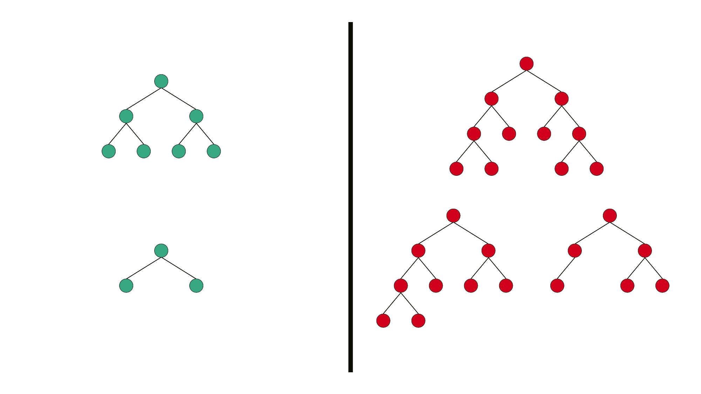

## 트리

#### 트리는 계층형 트리 구조를 시뮬레이션 하는 추상 자료형(ADT)로, 루트 값과 부모- 자식 관계의 서브트리로 구성, 서로 연결된 노드의 집합

- 재귀로 정의된 자기 참조 자료구조 -> 자식도 트리, 그 자식도 트리, 여러 개의 트리가 쌓아 올려져 큰 트리가 됨, 서브트리
- 트리의 각 명칭

자식 노드의 개수 - 차수(degree) / 깊이 - 현재 노드까지의 거리 / 레벨 0, 1,2,3....

### 그래프 vs 트리

- 가장 큰 차이 - 트리는 순환 구조를 갖지 않음 / 트리 - 단방향, 그래프 - 단, 양방향
- 순환구조, 부모가 하나, 루트가 하나
- 

#### 이진 트리

##### 정 이진 트리(Full binary Tree) - 모든 노드가 0개 혹은 2개의 자식노드 가짐

**완전 이진 트리(Complete Binary Tree) - 마지막 레벨을 제외하고 모든 레벨이 완전히 채워져 있으며, 마지막 레벨의 모든 노드는 가장 왼쪽부터 채워짐**

**포화 이진 트리(Perfect Binary Tree) - 모든 노드가 2개의 자식 노드를 갖고 있으며, 모든 리프 노드가 동일한 깊이 또는 레벨을 갖는다. 문자 그대로, 가장 완벽한 유형의 트리**

****

**Valid and Invalid Structure of Full Binary Tree** 

**Valid and Invalid Structure of Complete Binary Tree**

**Valid and Invalid Structure of Perfect Binary Tree**

### 실습파일 참조..

