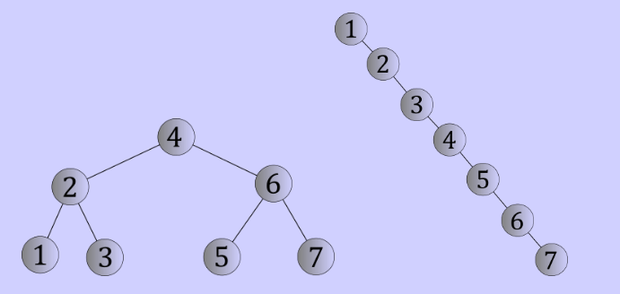
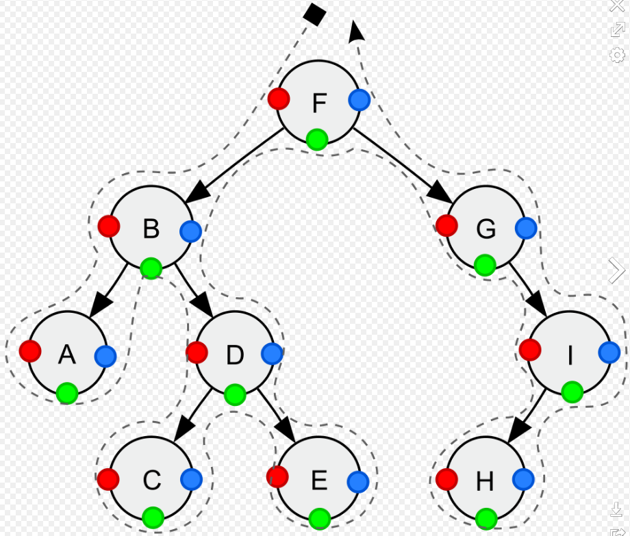

## 트리

#### 트리는 계층형 트리 구조를 시뮬레이션 하는 추상 자료형(ADT)로, 루트 값과 부모- 자식 관계의 서브트리로 구성, 서로 연결된 노드의 집합

- 재귀로 정의된 자기 참조 자료구조 -> 자식도 트리, 그 자식도 트리, 여러 개의 트리가 쌓아 올려져 큰 트리가 됨, 서브트리
- 트리의 각 명칭


자식 노드의 개수 - 차수(degree) / 깊이 - 현재 노드까지의 거리 / 레벨 0, 1,2,3....

### 그래프 vs 트리

- 가장 큰 차이 - 트리는 순환 구조를 갖지 않음 / 트리 - 단방향, 그래프 - 단, 양방향
- 순환구조, 부모가 하나, 루트가 하나
- 

#### 이진 트리

##### 정 이진 트리(Full binary Tree) - 모든 노드가 0개 혹은 2개의 자식노드 가짐

**완전 이진 트리(Complete Binary Tree) - 마지막 레벨을 제외하고 모든 레벨이 완전히 채워져 있으며, 마지막 레벨의 모든 노드는 가장 왼쪽부터 채워짐**

**포화 이진 트리(Perfect Binary Tree) - 모든 노드가 2개의 자식 노드를 갖고 있으며, 모든 리프 노드가 동일한 깊이 또는 레벨을 갖는다. 문자 그대로, 가장 완벽한 유형의 트리**


****

**Valid and Invalid Structure of Full Binary Tree** 


**Valid and Invalid Structure of Complete Binary Tree**


**Valid and Invalid Structure of Perfect Binary Tree**

### 실습파일 참조..

### 이진 탐색 트리(Binary search Tree)

- 정렬된 트리, 노드의 왼쪽 서브트리에는 그 노드의 값보다 작은 값들, 오른쪽 서브트리에는 그 노드의 값과 같거나 큰 값들로 이루어져 있는 트리, 탐색 시 시간 복잡도가 O(nlogn)
- 1억개의 아이템도 27번이면 찾을 수 있다.
- 
- 더 이상 노드가 없으면 '정답 없음'
- 트리 균형이 깨지면 최악의 경우 O(n)
- 

균형이 깨진 이진 탐색 트리

- 이런 트리는 균형을 맞출 필요가 있다 --> 자가 균형 이진 탐색 트리

#### 자가 균형 이진 탐색 트리(Self-Balancing Binary Search Tree)

- 자가 균형(또는 높이 균형) 이진 탐색 트리는 삽입, 삭제 시 자동으로 높이를 작게 유지하는 노드 기반의 이진 탐색 트리
- 최악의 경우에도 이진 트리의 균형이 잘 맞도록 한다. 높이를 가능한 한 낮게 유지
- 
- 노드가 100만개라면 최악의 경우 100만번, 균형이 완벽한 경우 log1000000 -> 19번 만에 찾기 가능

#### 자가 균형 이진 탐색 트리에는 AVL트리와 레드-블랙 트리 등이 있다.

- 실무에서는 레드 블랙 트리가 빈번히 쓰인다.
- 문제 50번 참고 그림


#### 트리 순회



Depth-first traversal (dotted path) of a binary tree:

- *Pre-order (node visited at position red)*: (**NLR**)
    F, B, A, D, C, E, G, I, H;
- *In-order (node visited at position green)*:(**LNR**)
    A, B, C, D, E, F, G, H, I;
- *Post-order (node visited at position blue)*:(**LRN**)
    A, C, E, D, B, H, I, G, F.

```python
def preorder(node):
    if node is None:
        return
    print(node.val)
    preorder(node.left)
    preorder(node.right)

def inorder(node):
    if node is None:
        return    
    inorder(node.left)
    print(node.val)    
    inorder(node.right)

def postorder(node):
    if node is None:
        return
    postorder(node.left)
    postorder(node.right)
    print(node.val)    
```

