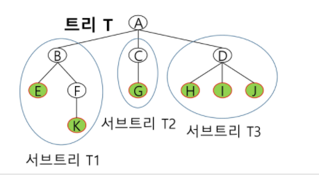

# 배열 인덱스

- 베이비진, 전기버스 같은거

# 탐색

- ### 정렬 

  - **선택정렬**
  - **병합정렬**
  - **퀵정렬(구현방법 3가지)**

- **재귀 호출을 통한 순열 생성**

- **바이너리 카운팅 부분집합**

- ### 이진검색

- ### 백트래킹 -  nqueen, 순열

  - ```python
    import sys
    input = sys.stdin.readline
    
    def check(x):
        for i in range(x):
            if rows[x] == rows[i] or abs(rows[x] - rows[i]) == x - i:
                return False
        return True
    
    def dfs(x):
        global cnt
    
        if x == n:
            cnt += 1
            return
    
        for i in range(n):
            if visited[i]: 
                continue
    
            rows[x] = i
            if check(x):
                visited[i] = True
                dfs(x+1)
                visited[i] = False
    
    n = int(input())
    rows = [0] * n
    visited = [False] * n
    cnt = 0
    
    dfs(0)
    print(cnt)
    ```

- ### 트리

  - 트리개념
    - 트리는 싸이클이 없는 무향 연결 그래프이다.
      - 두 노드(or 정점) 사이에는 유일한 경로가 존재한다.
      - 각 노드는 최대 하나의 부모 노드가 존재할 수 있다.
      - 각 노드는 자식 노드가 없거나 하나 이상이 존재할 수 있다.
    - 비선형 구조
      - 원소들 간에 1:n 관계를 가지는 자료구조
      - 원소들 간에 계층관계를 가지는 계층형 자료구조
    - 한 개 이상의 노드로 이루어진 유한 집합이며 다음 조건을 만족
      - 노드 중 부모가 없는 노드를 루투(root)라 한다.
      - 나머지 노드들은 n(>=0)개의 분리 집합 T1,---,TN으로 분리될 수 있다.
    - 이들 T1,---,TN은 각각 하나의 트리가 되며 루트의 서브트리라고 함
    - 
    - 
      - 노드 - 트리의 원소이고 vertax라고도함
      - 간선 - 노드를 연결하는 선
      - 루트노드 - 트리의 시작 노드
      - 형제 노드 - 같은 부모 노드의 자식 노드들
      - 조상 노드 - 간선을 따라 루트노드까지 이르는 경로에 있는 모든 노드
        - L의 조상노드 : A, Q, P
      - 서브 트리 - 부모 노드와 연결된 간선을 끊었을 때 생성되는 트리
      - 자손 노드 : 서브 트리에 있는 하위 레벨의 노드들
      - 차수(degree) 
      - 노드의 차수 : 노드에 연결된 자식 노드의 수
      - 트리의 차수 : 트리에 있는 노드의 차수 중 가장 큰 값
      - 단말 노드: 차수가 0인 노드, 리프노드
      - 노드의 높이 : 루트에서 노드에 이르는 간선의 수, 노드의 레벨
      - 트리의 높이 : 트리에 있는 노드의 높이 중에서 가장 큰 값
  - 이진트리개념
    - 모든 노드들이 최대 2개의 서브 트리를 갖는 특별한 형태의 트리
    - 각 노드가 자식 노드를 최대한 2개 까지만 가질 수 있는 트리
    - 레벨 i 에서 노드의 최대 개수 2^i개
    - 높이가 h인 이진 트리가 가질 수 있는 노드의 최소 개수는 h+1 개가 되며, 최대 개수는 2^(h+1)-1개
  - 포화이진트리개념()
    - 모든 레벨의 노드가 포화상태로 채워져 있는 이진 트리
    - 높이가 h일때 최대의 노드 개수인 2^(h+1) - 1의 노드를 가진 이진 트리
    - 

  - 완전이진트리개념
    - 높이가 h이고 노드 수가 n개일 때, 포화 이진 트리의 노드번호 1번부터 n번까지 빈 자리가 없는 이진트리
    - 
  - 편향이진트리개념
    - 높이 h에 대한 최소 개수의 노드를 가지면서 한쪽 방향의 자식 노드만을 가진 이진 트리
    - 
  - 트리순회구현
    - 집가서
  - 배열을 이용한 이진트리(단점)
    - 루트 번호 1번
    - 왼쪽에서 오른쪽 2^n, 2^(n+1) - 1
    - 
    - 
    - 현재 노드 i -> 부모노드 i//2 -> 자식노드 2*i, 2*i+1
    - 레벨 n의 노드 번호 시작 번호 2^n
    - 필요한 배열의 크기 = 2^(h+1) - 1
    - 편향 이진 트리의 경우에 사용하지 않는 배열 원소에 대한 메모리 낭비 발생
    - 트리 중간에 새로운 노드 삽입 힘듬
  - 연결리스트를 이용한 이진트리
    - 
    - 이진 트리의 모든 노드는 최대 2개의 자식 노드를 가지므로 일정한 구조의 단순 연결 리스트 노드를 사용하여 구현
  - 이진 탐색 트리 구현, 성능
    - 탐색작업을 효율적으로 하기 위한 자료구조
    - 모든 원소는 서로 다른 유일한 키를 갖는다.
    - key(왼쪽 서브트리) < key(루트 노드) < key(오른쪽 서브 트리)
    - 왼쪽 서브 트리와 오른쪽 서브 트리도 이진 탐색트리이다.
    - 중위 순회하면 오름차순으로 정렬된 값을 얻을 수 있다.
    - 탐색연산
      - 루트에서 탐색 시작
      - 탐색할 키 값 x를 루트 노드의 키 값 k와 비교
        - x == k: 탐색 성공
        - x < k :  루트 노드의 왼쪽 서브 트리에 대해서 탐색연산 수행
        - x > k : 루트 노드의 오른쪽 서브 트리에 대해서 탐색연산 수행
      - 서브 트리에 대해서 순환적으로 탐색 연산을 반복
      - 탐색 수행할 서브 트리가 없으면 탐색 실패
    - 삽입 연산
      - 먼저 탐색 연산을 수행
        -  삽입할 원소와 같은 원소가 트리에 있으면 삽입할 수 없으므로,
          같은 원소가 트르에 있는지 탐색하여 확인한다.
        - 탐색에서 탐색 실패가 결정되는 위치가 삽입 위치가 된다.
      - 탐색 실패한 위치에 원소를 삽입
      - 
    - 삭제 연산
      - 차수가 0인 경우(그냥 삭제)
      - 차수가 1 인 경우(탐색, 삭제, 후속처리)
      - 차수가 2인 경우 (탐색, 후보찾기, 이동)
      - 
      - 
      - 탐색, 삽입, 삭제시간은 트리의 높이만큼 시간이 걸린다.
        - O(h), h : BST의 깊이(height)
      - 평균의 경우
        - 이진 트리가 균형적으로 생성되어 있는 경우
        - O(logn)
      - 최악의 경우
        - 한쪽으로 치우친 편향 이진 트리의 경우
        - O(n)
        - 순차탐색과 시간복잡도가 같다.

- ### 힙(heap)

  - 완전 이진 트리에 있는 노드 중에서 키 값이 가장 큰 노드나 키 값이 가장 작은 노드를 
    찾기 위해서 만든 자료구조

  - 최대 힙 - 키 값이 가장 큰 노드를 찾기 위한 완전 이진 트리
    부모 노드의 키 값 > 자식 노드의 키 값
    루트 노드 : 키 값이 가장 큰 노드

  - 최소 힙 - 키 값이 가장 작은 노드를 찾기 위한 완전 이진 트리
    부모 노드의 키 값 < 자식 노드의 키 값
    루트 노드 : 키 값이 가장 작은 노드

  - 

  - 힙이 아닌 이유 설명

  - 

    - 최소힙이나 최대힙이여야 하는데 아무것도 아니므로 탈락

  - 삽입 과정 설명

  - 

  - 삭제 과정 설명

    - 힙에서는 루트 노드의 원소만을 삭제 할 수 있다.
    - 루트 노드의 원소를 삭제하여 반환한다.
    - 힙의 종류에 따라 최대값 또는 최소값을 구할 수 있다.
      - 우선순위 큐와 비교

    - 

  - 힙 활용처

    - 힙을 활용하는 대표적인 2가지 예는 특별한 큐의 구현과 정렬
    - 우선순위큐를 구현하는 가장 효율적인 방법이 힙을 사용하는 것이다.
      - 노드 하나의 추가/삭제가 시간 복잡도 O(logN)이고 최대값/최소값을 O(1)에 구할 수 있다.
      - 완전 정렬보다 관리비용이 적다
    - 배열을 통해 트리 형태를 쉽게 구현할 수 있다.
      - 부모나 자식 노드를 O(1)연산으로 쉽게 찾을 수 있다.
      - n위치에 있는 노드의 자식은 2n과 2n+1위치한다.
      - 완전 이진 트리의 특성에 의해 추가/삭제의 위치는 자료의 시작과 끝 인덱스로 쉽게 판단할 수 있다.

  - 힙 정렬

    - 힙 정렬은 힙 자료구조를 이용해서 이진 탐색과 유사한 방법으로 수행돈다.
    - 정렬을 위한 2단계
      - 하나의 값을 힙에 삽입(반복)
      - 힙에서 순차적(오름차순)으로 값을 하나씩 제거한다.
    - 힙 정렬의 시간 복잡도
      - n개의 노드 삽입 연산 + n개의 노드 삭제 연산
      - 삽입과 삭제 연산은 각각 O(logN)이다.
      - 따라서, 전체 정렬은 O(NlogN)이다.
    - 힙 정렬은 배열에 저장된 자료를 정렬하기에 유용하다.