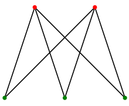
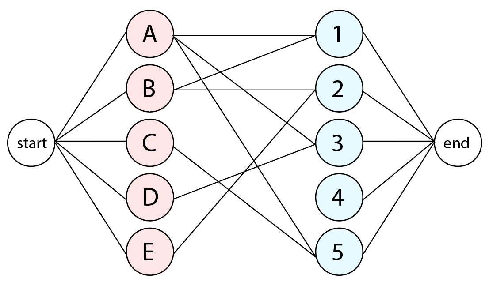
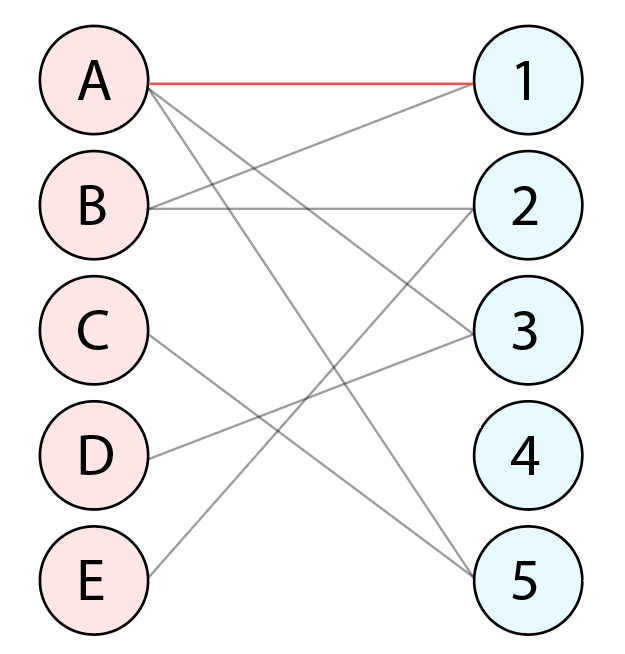
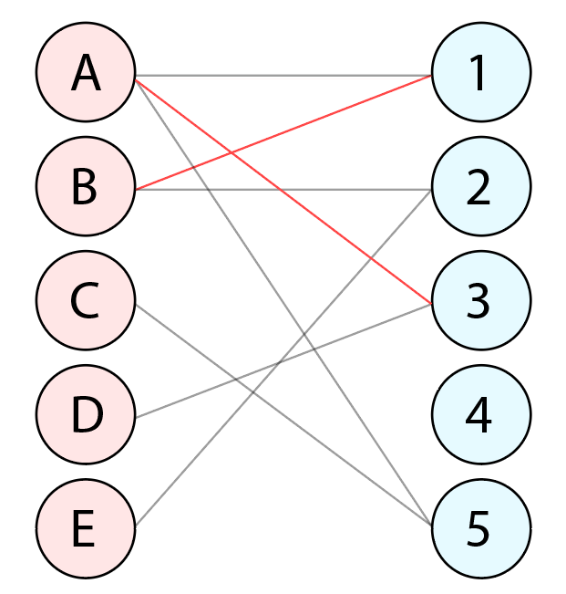
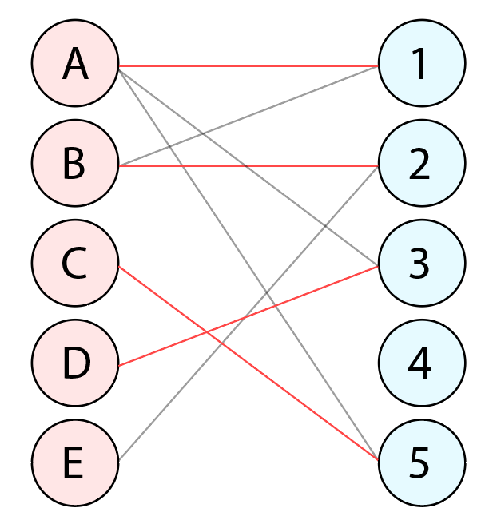
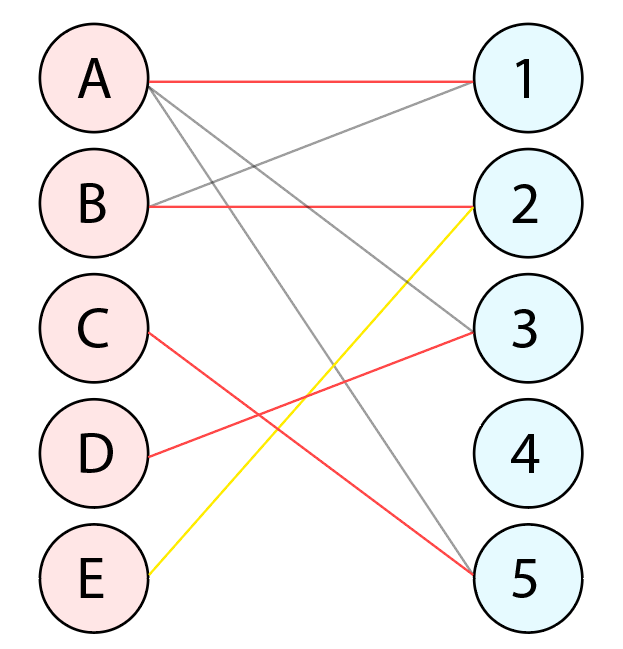
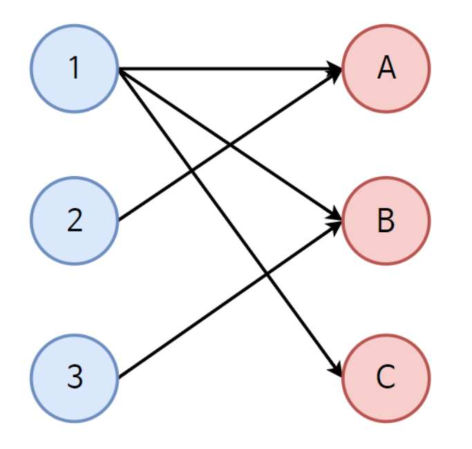

# 이분매칭

- 두 개의 정점 그룹이 존재할 때 **모든 간선(경로)의 용량이 1**이면서 양쪽 정점이 서로 다른 그룹에 속하는 그래프를 **이분 그래프(Bipartite Graph)**라고 말합니다. 이러한 이분 그래프에서 예를 들어, 한쪽 그룹은 X 그룹, 다른 한쪽 그룹은 Y 그룹이라고 할 때 **모든 경로의 방향은 X->Y인 그래프의 최대 유량을 구하는 것**이 **이분 매칭(Bipartite Matching)**입니다. 

- 이분 그래프 - 모든 꼭짓점을 빨강과 초록으로 칠하되, 모든 변이 빨강과 초록 꼭짓점을 포함하도록 하는 그래프

- 

  이분 매칭을 통해 구하고자 하는 것은 최대 매칭 수입니다. 매칭을 한다는 것은 어떤 정점이 그것이 가리키는 위치의 다른 정점을 점유한 상태를 말하며 **각 정점은 한 개씩만 점유 가능하고 여러개의 정점을 점유할 수 없습니다.** 간선의 용량이 1인 것은 바로 이러한 이유에서입니다. 

- 알고리즘 원리
- 
- 간선 용량이 1인 네트워크 플로우, DFS를 적용해 효율적으로 복잡도를 구현 가능
- 정점 A는 정점 1을 점유할 수 있다.(총 매칭 수: 1)
- 
- 정점 B는 정점 1을 점유하려고 하나, A가 정점 1을 점유하고 있으므로, A는 다른 정점을 점유하러 경로를 다시 찾음, 정점 3이 비어있으므로 A는 정점 3을 점유(총 매칭 수: 2)
- 
- 정점 C는 5를 점유(총 매칭 3)
- 
- 정점 D는 정점 3을 점유하려고하나 이미 A가 점유 중, 그래서 A가 다른 경로를 찾아 정점 1을 점유하려고 함, 근데 B가 정점 1을 점유, 그럼 B가 다른 경로를 찾아 비어있던 정점 2를 점유 (총 매칭 수: 4)
- 여기서 E가 정점 2를 점유하려고 하나, 그렇게 되면 B, A, D가 계속해서 다시 경로를 찾는 행위가 반복되기 때문에 매칭이 불가하게 된다.
- 따라서 최종 매칭수 4
- 시간 복잡도 O(VE)
- 
- 알고리즘의 의미 - **효과적으로 매칭시키는 방법 찾기, 최대 매칭 수 찾기, 모든 사람이 각각 어떤 것을 선책하여 가장 많이 연결되는 경우를 찾는 문제에 사용**
- 

```python
max = 101
vector = [[] for i in range(max + 1)]
dept = [ 0 for i in range(max + 1)]
# visited = [ False for i in range(max + 1)]
n = 3
m = 0

def dfs(x, visited):
    for v in vector[x]:
        t = v
        if visited[t]: continue
        visited[t] = True
        if dept[t] == 0 or dfs(dept[t], visited):
            dept[t] = x
            return True
    return False
    
def main():
    vector[1].append(1)
    vector[1].append(2)
    vector[1].append(3)
    vector[2].append(1)
    vector[3].append(2)
    count = 0
    # visited = [ False for i in range(max + 1)]
    for i in range(1, n + 1):
        visited = [ False for i in range(max + 1)]
        if dfs(i, visited): count += 1
    print(f'{count}개의 매칭이 이뤄졌습니다.')
    for i in range(1, max + 1):
        if not dept[i] == 0:
            print(f'{dept[i]} -> {i}')
            
main()
출처: https://binaryjourney.tistory.com/165 [Binary Journey:티스토리]
```

