# 최소신장트리(MST)

- minimum spanning tree
- 신장 트리는 그래프에서 모든 정점에 대한 최소한의 연결만을 남긴 그래프이다. 한 곳으로 도달하는 경우가 두 개 이상 존재하는 경우, 즉 사이클이 존재하는 경우에는 최소한의 연결이라 말할 수 없기 때문에, 모든 위치 하나에서 다른 곳으로 이동하는 경우는 단 한 가지로 결정되도록 항상 트리의 형태를 나타낸다. 최소 비용 신장 트리는 이러한 신장 트리들 중 간선의 가중치 합이 가장 작은 트리이다.
- 프림 알고리즘과 크루스칼 알고리즘이 있다.
- 프림 알고리즘은 바이너리 힙을 사용하면 O(|E| + |V|log|V|)의 시간 복잡도
- 크루스칼 알고리즘은 경로 최적화를 이용하지 않으면 O(|E|log|V|), 경로 최적화를 이용하는 
  경우 O(|E|log*|V|) (참고: *l**o**g*∗*n*: n*n*이 1 아래로 될 때 까지의 log 수행 횟수. 예) log log log log 1000 \le 1*l**o**g**l**o**g**l**o**g**l**o**g*1000≤1이기 때문에 log^* 1000 = 4*l**o**g*∗1000=4. 매우 느리게 증가하는 함수로 이해하면 된다.)의 시간복잡도를 가지기 때문에, 그래프의 간선 밀도를 고려해 최적의 알고
  리즘을 선택하는 것이 필요하다.
- 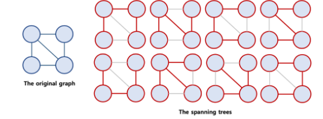
- 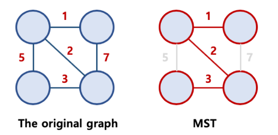

### 1-1. 프림 알고리즘

- 가중치가 있는 무방향 그래프에서 최소 비용 신장 트리를 구하는 그리디 알고리즘

- 우선순위 큐를 이용해 구현 *O*((*V*+*E*)log*V)*

- 다익스트라 알고리즘과 거의 동일 - 다익스트라 알고리즘의 평가 함수에서 현재 경로까지의
  이동거리를 누적하지 않고 간선 가중치만을 이용한다면 프림알고리즘이 된다.

- 음수의 가중치가 있어도 가능하다.

  - 1. 임의의 정점을 성택해 하나의 정점을 갖는 최초의 트리를 구성
    2. 트리에 포함된 정점과 트리에 포함되지 않은 정점 간의 간선 중 가장 작은 가중치를
       가지는 간선을 선택해 트리에 추가한다.
    3. 모든 정점이 트리에 포함될 때 까지 2를 반복한다.

- ```python
  import heapq
  import collections
  import sys
  sys.setrecursionlimit(10**6)
  input = sys.stdin.readline
  
  n, m = map(int,input().split()) # 노드 수, 간선 수
  graph = collections.defaultdict(list) # 빈 그래프 생성
  visited = [0] * (n+1) # 노드의 방문 정보 초기화
  
  # 무방향 그래프 생성
  for i in range(m): # 간성 정보 입력 받기
      u, v, weight = map(int,input().split())
      graph[u].append([weight, u, v])
      graph[v].append([weight, v, u])
  
  
  # 프림 알고리즘
  def prim(graph, start_node):
      visited[start_node] = 1 # 방문 갱신
      candidate = graph[start_node] # 인접 간선 추출
      heapq.heapify(candidate) # 우선순위 큐 생성
      mst = [] # mst
      total_weight = 0 # 전체 가중치
  
      while candidate:
          weight, u, v = heapq.heappop(candidate) # 가중치가 가장 적은 간선 추출
          if visited[v] == 0: # 방문하지 않았다면
              visited[v] = 1 # 방문 갱신
              mst.append((u,v)) # mst 삽입
              total_weight += weight # 전체 가중치 갱신
  
              for edge in graph[v]: # 다음 인접 간선 탐색
                  if visited[edge[2]] == 0: # 방문한 노드가 아니라면, (순환 방지)
                      heapq.heappush(candidate, edge) # 우선순위 큐에 edge 삽입
  
      return total_weight
  
  print(prim(graph,1))
  ```

  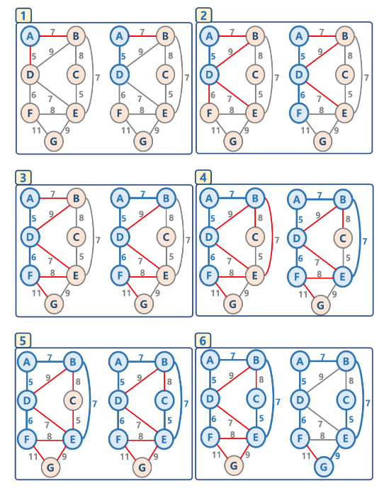

  

### 1-2. 크루스칼 알고리즘

- 최소 비용 신장 트리를 O(ElogV)만에 구하는 알고리즘
- 그래프의 모든 간선의 집합 E을 만든다.
- E가 비어있지 않을 때까지
  - E의 간선들 중 가중치가 최소인 간선을 지운다.
  - 삭제된 간선이 가리키는 정점을 x, y를 연결하여도 사이클이 발생하지 않는다면 연결한다.

- 다른 설명
  - 1. 모든 정점을 독립적인 집합으로 만든다.
    2. 모든 간선을 비용을 기준으로 정렬하고, 비용이 작은 간선부터 양 끝의 두 정점을 비교한다.
    3. 두 정점의 최상위 정점을 확인하고, 서로 다를 경우 두 정점을 연결한다.(사이클 확인)
    4. 탐욕알고리즘 기반임
  - 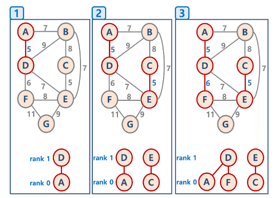
  - 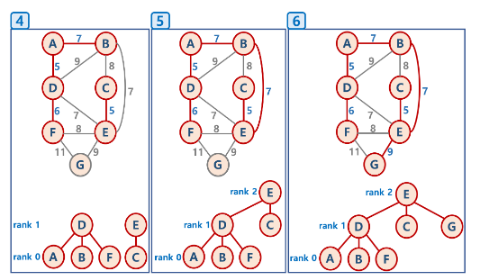

#### 1-2-1. Union-Find 알고리즘

- Disjoint Set을 표현할 때 사용하는 알고리즘으로 트리 구조를 활용하는 알고리즘

- 간단하게, 노드들 중에 연결된 노드를 찾거나, 노드들을 서로 연결할 때 사용

- Disjoint Set이란

  - 서로 중복되지 않는 부분 집합들로 나눠진 원소들에 대한 정보를 저장하고
    조작하는 자료구조
  - 공통 원소가 없는 (서로소) 상호 배타적인 부분 집합들로 나눠진 원소들에
    대한 자료구조를 의미함
  - Disjoint Set = 서로소 집합 자료구조

- 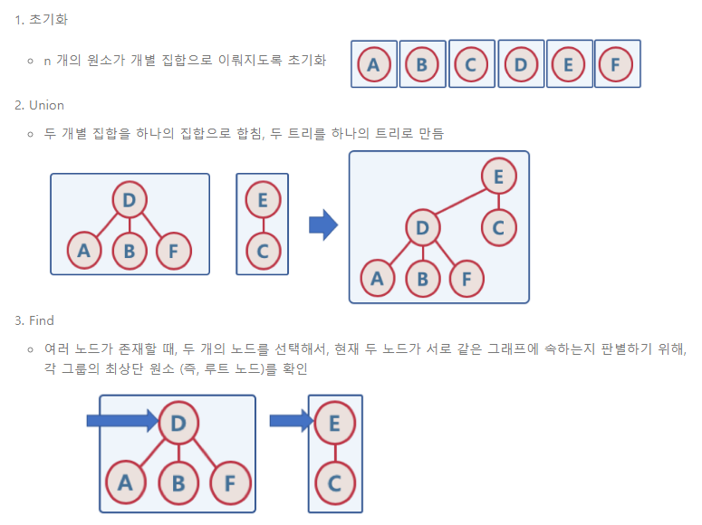

- 주의점

  - Union 순서에 따라서, 최악의 경우 링크드 리스트와 같은 형태가 될 수 있음
  - 이 때는 Find/Union 시 계산량이 O(N)이 될 수 있으므로, 해당 문제를 해결하기 위해,
    union-by-rank, path compression 기법을 사용함
  - 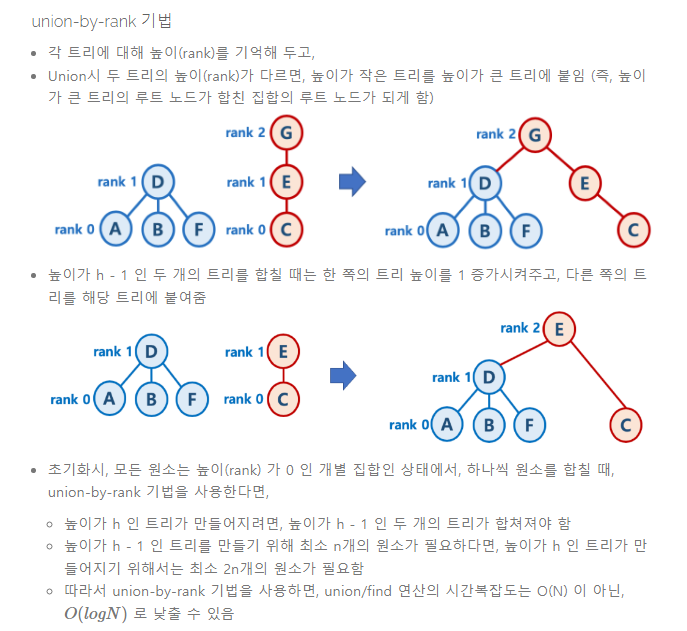

  - 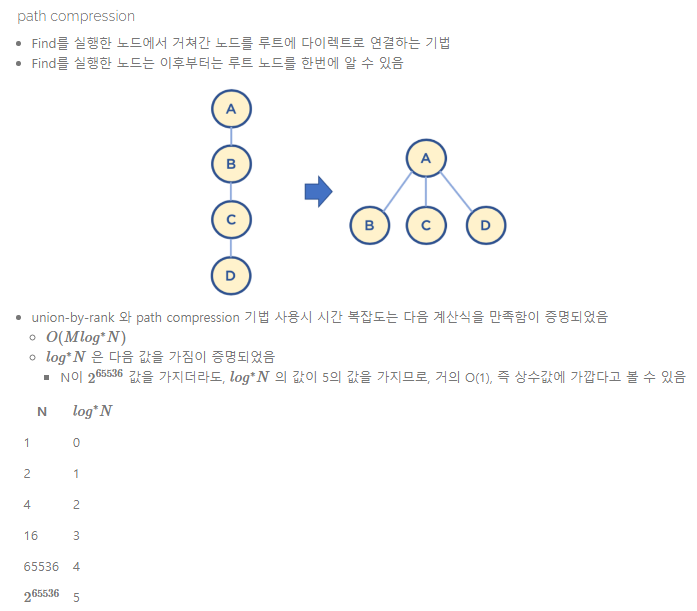

```python
```

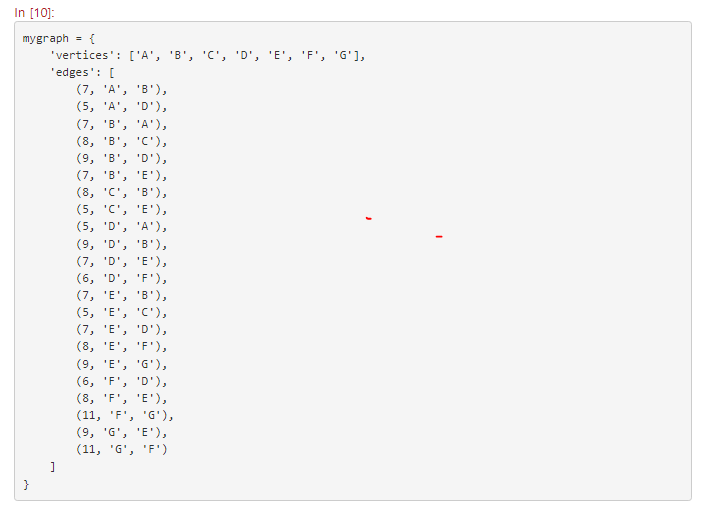

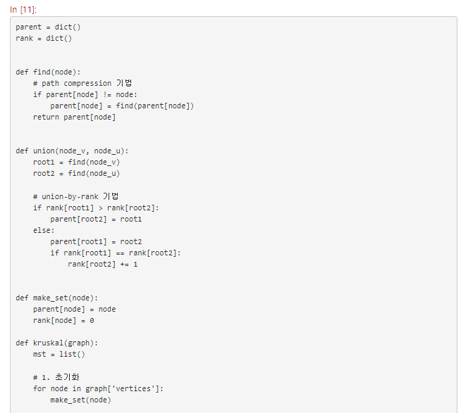

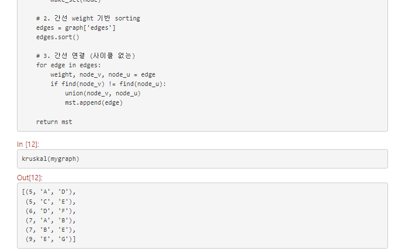

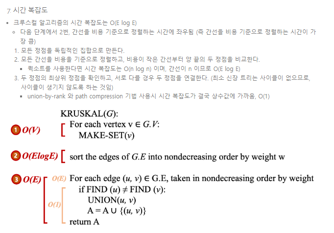